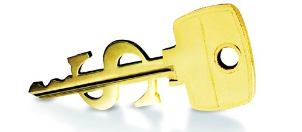

I was writing about my own startup companies, then found Ryan Carson's post on "building his web applications".

Here is the part of the post I found particularly interesting, the contract:

> Elliott [the developer] will receive 10% of monthly revenues, after the expenses listed above. If he launches the site on time (3pm April 20th), this will increase to 15% (hat tip to Natasha on that idea). When the site hits $25,000 monthly revenue (excluding VAT), his take will increase to 25%.

His monthly cheque will be determined by a snapshot of the revenue on the 1st of every month at 9am.

If the app is sold, Elliott will receive 10% of the cash price, after lawyer and accountancy costs.

I build web applications so I can relate to Elliott here as well as many of you (my readers). The only difference between me and Elliottis that I own the company who knows all the people to hire and how to get it done. My company is called,"MJG International"and establishes these type of business partnerships.

## Carsonified Wins, Elliott Loses (mostly)

Before I rip apart the Carsonified contract, I want to say quick - Ryan Carson, if you are reading this thank you for sharing the information, it serves as a good example to work from. And certainly I am not accusing you of being dishonest - I just don't agree with the contract.

Now here is my opinion on the Carsonified-Elliot contract. I'm not sure why Elliott would build the product for _no money_ and 10-25% of the application under certain performance terms. **I think this is a really bad contract completely in the favor of Carsonified.** Here is why it sucks for Elliott:

- **Carsonified has no risk** . They are covered legally and don't have to pay the labor, all the risk is on Elliott's shoulders.
- **Carsonified can expand and change the contract** of the product as much as they want and Elliott is still pressured to get it done by a certain date to keep his larger percentage.
- **Carsonified doesn't even have to pay for support costs** after the product is launched, because Elliott has to answer support emails within 24 hours.
- **Carsonified gets at least 75% of the revenue** , Elliott is the one taking the risk here and gets just a slice of the revenue.
- **Carsonified owns all code and intellectual property** -- Elliott owns nothing when it is all over but a cut after expenses.

Wow, talk about getting kicked in the butt by a contract. Carsonified gets all the cheese for having the idea and negotiating the contract. Good work negotiating, Carsonified!

## How To Negotiate a _Good_ Contract

Now I'd like to share with you how I negotiate a contract. When I say,"you"here that means you as the developer. Assuming you want to go on these ventures.

- **Chose a partnership with business who _care about you_ and you care about their product.** This is tough in a for-profit world, but I've managed to do it. There is an over-abundance of companies with ideas and a shortage of developers who can actually accomplish it - know that as leverage to negotiate a fair contract.
- **If you build it, you should own everything that doesn't apply specifically to that project.** You need to build products with reusable code so you can start other companies. You can even open source engines from it, like Ruby on Rails did.
- **Require money up-front enough to get you by.** Creating _good_ web applications is tough, _real tough_ - even the simplest things can become complex when you consider everything it takes to create something that will be really worthwhile. You may not be able to do this until you have a fair amount of success under your belt.
- **Get at _minimum_ 30% of the revenue of the tool if you are working for free** . I do 30% plus an initial 2 months of operating capitaldepending on the project, but again - that is because of experience.
- **Get a lawyer you trust to review the contract before signing.** They will remove language that doesn't protect your rights.
- **Create a startup company for the product that is it's own company**, as a subsidiary of the company you are working with and get 30% stock in it. That way if the company is sold, you get 30% of the selling price.

That is all off the top of my head. Because I've been through this I feel it is my duty to protect the on-the-ground workers who can actually finish products. Once I get good at executing and have a lot of successes under my belt, I'll probably take more like 70% of the product instead of 30%, since the only thing the company partnering with you is doing is have the initial idea, which is important - but **everybody has ideas! Execution of the idea means a lot, especially in web development.**

Let me assure you that **I value the business partnerships I make and their ideas**. The contracts I've made so far have been fair and everyone has been great to work with! I hope you all reading this can have the same.

Be fair, don't be square. You rock, peace all.
