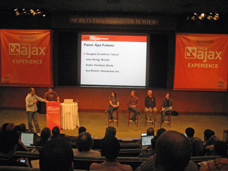
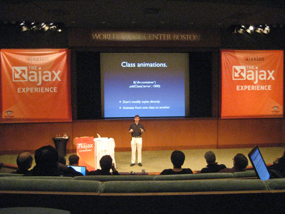
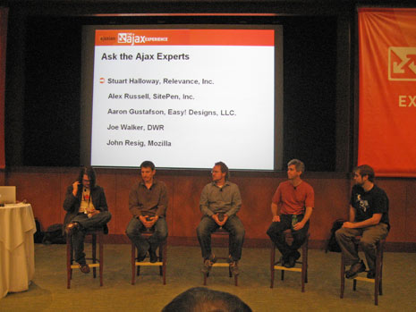

**[Part 1: Ajax Experience Tutorial Sessions](/ajax-experience-tutorial-sessions)**
**Part 2: Ajax Experience Roundup**

The final part of my coverage on [The Ajax Experience in Boston](http://ajaxexperience.techtarget.com/) .

## jQuery Advanced

### [John Resig](http://ejohn.org)

Hands-on step-by-step demonstration of the power of jQuery. John started with a small server-side application and then wrote slick UI on top of it with jQuery. The final product of the presentation is a [small social networking application](http://jquery.com/files/social/) that looks really nice (reset the demo by appending ?action=reset to the url). John wrote all 82 lines of JavaScript in front of us while talking through each step during the one hour session.

[John's Slides](http://ajaxexperience.techtarget.com/images/Presentations/Resig_John_jQueryAdvanced.pdf)

## Ajax on Struts

### [Ted Husted](http://husted.com/ted/Home.html)

Ted explained how to use Ajax on Struts 2 by showing code examples - which ment for a very dry presentation. Most developers still use an old version of Struts (1.2) to which the code examples don't apply. Struts 2 looks like another framework that tries to do to much at once and fails to be widely accepted. It renders components with Dojo, which ties the application to a specific framework. It isn't a backend developer's responsibility to render front-end controls. I want the backend developers to give me the data rather than rendering components.

In order for a backend framework to be useful to me it must leave the presentation layer alone and be appealing to backend developers. Since most Java developers are not moving to Struts 2, it looks like the framework fails on both of those key points.
[Ted's Slides](http://ajaxexperience.techtarget.com/images/Presentations/Husted_Ted_AjaxonStruts.pdf)

## Design Patterns and Animation with jQuery

### [Paul Bakaus](http://www.paulbakaus.com/)

Paul overviewed some of the recent happening online that replicate we know and love on the desktop, such as drag&drop and collapse&expand. He put a term to these interactions called,design patterns". Design patterns are solutions for interactive, navigation and visualization problems. On the browser they are often JavaScript based. Then he showed off real world examples and how they are coded in JavaScript. He finished by showing the ready to use components in the "jQuery User Interface library (JUI).
[Paul's Slides](http://ajaxexperience.techtarget.com/images/Presentations/Bakaus_Paul_DesignPatters_jQuery.pdf)

## Hands on DWR

### [Joe Walker](http://getahead.org/blog/joe/)

[DWR](http://getahead.org/dwr) seemed to be the most valuable thing to bring back to the company I work for. With DWR, you can expose Java classes to JavaScript. The library seems to be the best for keeping seperate the data and presentation layers, which is key for frontend and backend developers to work well together. DWR doesn't try to bite off more than it can chew - it doesn't try to be a widget library like [GWT](http://code.google.com/webtoolkit/) and [JMaki](http://jmaki.com/) . Backend developers should deal with data and frontend developers should deal with presentation. Joe Walker goes to great lengths to make sure DWR uses secure practices. I am very excited to see if this will work out in our web applications.

[Joe's Slides](http://ajaxexperience.techtarget.com/images/Presentations/Walker_Joe_HandsonDWR.pdf)

## Ajax Experts and Ajax Futures Panel

### - [Alex Russell - Sitepen and Dojo](http://alex.dojotoolkit.org/)

### - [Joe Walker - DWR](http://getahead.org/blog/joe/)

### - [John Resig - Mozilla](http://ejohn.org)

### - [Douglas Crockford - Yahoo](http://www.crockford.com/)

### - And other web app / UI experts

These panels were the highlight of The Ajax Experience for me. It really was hilarious to see such conflicting opinions come through on both sides. It kind of felt like a spectator sport as you root for the person that you identify most with. When I look back at it two memorable moments stand out to me.

The first moment was when John Resig made the point that paid licenses provided by frameworks - simply for the sake of having a license (no support included) - have no tangible benefit. Providing that type of licensing is an out-dated practice and they are, "appealing to companies who are boring and dull" [croud laughed loudly].

The second memerable moment was the debate on the new [JavaScript 2 (ECMAScript 4)](http://www.ecmascript.org/) standard that Mozilla, Opera and Adobe have put together and are implimenting. The debate was largely between John Resig (for JS2) and Douglas Crockford (against JS2). Doug shared with us strong opposition to JavaScript 2. He said that it is introducing complexity into a language that is ment to be for anyone to pick up. He also said it would break existing applications. John countered these complaints by saying that JavaScript 2 is purely opt-in. That these complexities are purely optional and that JavaScript 2 is fixing the broken parts of the language.

I also asked Joe Walker (DWR) a question about JavaScript frameworks that are tied to a server side language. Although I didn't get a thorough answer, he said that he is only trying to do one thing really well, rather than getting wide appeal like the frameworks that widgets are being built on. I am impressed with Joe's attitude with DWR of sticking to doing one thing and doing it well.

## Advanced JSON

### Kris Zyp

Kris pulled off some crazy things with JSON, but I have to admit that most of it went over my head. He showed a demo of live editing an dynamic object tree, which was cool but didn't seem to me like anything you couldn't pull off with MySQL/Ajax.

[Kris' Slides](http://ajaxexperience.techtarget.com/images/Presentations/Zyp_KrisP_BOS_Advanced_JSON.pdf)

## Performance Analysis with YSlow for Firebug

### Tenni Theurer of Yahoo

One of the biggest things I got from the Yslow session was the 80/20 rule. That is, that 80 percent of the performance of the website [depends on the front end weight of the page](http://developer.yahoo.net/blog/archives/2007/03/high_performanc.html). That article was eye-opening to me. That my job as a front end developer heavily matters to the overall speed of the web applications.

Yslow gives your website a grade in order to motivate you to increase the speed of your page. My website receives an "A" in almost all categories except for using aCDNand setting an expires header - pretty good I think. Thank you Yahoo for building such a great tool.

You may download the [Yslow firebug plugin here](http://developer.yahoo.com/yslow/) and analyize your own website.

## My Ajax Experience Overall

The registration cost was hefty (\$1200), but the company I work for, RMG Connect paid for my registration fee. The overall experience was pretty amazing. I met some great people - especially the jQuery guys. Talking directly to the framework authors was an invaluble experience. Knowing the person's motivations behind creating their library really clues you into the longevity and energy behind a project.

This is the first time that I have covered something like this in so much detail so it is important to me to have your feedback.
