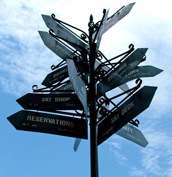

My RSS Reader is my window to the world. I grabbed all of Jonathan Snook's feeds from his public bloglines account (though today I'd [grab Paul Irish's](http://www.paulirish.com/2011/web-browser-frontend-and-standards-feeds-to-follow/)).

That gave me about 19,000 articles to read. In 6 months time, I read all the new articles as well as a backlog of 8,000 articles. I am now down to 11,000 articles. It feels like for the last 6 months I have ate way too much brain food each day.

My mind gets full of information and I slow down when producing. So now it is time to slow down the intake of information and focus on producing. I hope to have a lot of great work accomplished in the next few months.
