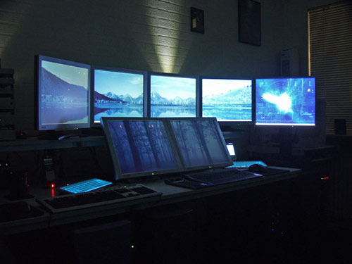
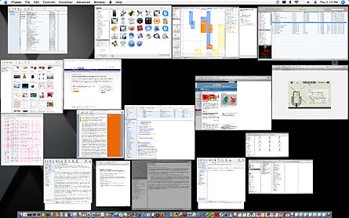

[Photo is Stefan Didak's Home Office](http://www.stefandidak.com/office/index.php)

This office is amazing. Although it looks like overkill, adding more monitor real estate can drastically increase productivity.

- More information up at one time.
- Lower the amount of times that you minimize and expand windows.
- Multitasking is much easier.

Apple didn't think it was a good idea to be minimizing and expanding windows all day either. This is why they developed expose.

Expose allows you to see all of your windows laid in front of you so you can choose the appropriate one. This is so much better than searching through your taskbar to find the right window.

Overall, it solved some inefficiencies and frustrations when I switch to duel monitors in 2001. It is a great investment I will never go back to one monitor. Unless, of course I have a Mac laptop.
