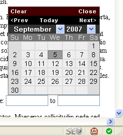

We added a feature to [jQuery calendar](jquery-ui-datepicker) that repositions the calendar back into the viewable window. It wasn't working right so I took it into my hands to figure out why.

First, I needed to determine if the calendar is outside the browser window:


- BrowserY - The browser's window position from the top of the document.
- Browser Height - The height of the browser window.
- CalendarY - The calendar's position from the top of the document.
- Calendar Height - The height of the calendar.

Once we get these values, then we can compare the two pairs together to determine if the calendar is outside the window. For instance:

```js
if ( (BrowserY + BrowserHeight)>(CalendarY + CalendarHeight) )
```

This would tell us if the calendar is outside the window.

Seems easy? Well, no because of the browser differences. I will show you that in a bit. So lets get the two easy values. Since the calendar is a div, these simple attributes work accross the tested browsers (IE6+, FF, Opera and Safari):

- CalendarY = `calendarDiv.offsetTop`
- CalendarHeight = `calendar.offsetHeight`

Getting the browser height and browserY was more challenging. Browsers were getting different heights for the same property! Go figure (sarcasm).

In trying to find out what browsers used to calculate heights, I found a great resource at quirksmode to [test browser height and width variables](http://www.quirksmode.org/js/doctype_on.html). Thank God for that page, I was able to figure out **exactly** what the browser was doing with each variable. This [JavaScript Window Size and Height](http://www.howtocreate.co.uk/tutorials/javascript/browserwindow) tutorial was also helpful.

In testing I found out a few things. To get the browser height, window.innerHeight worked pretty well for most browsers. Then to get the browser height in the rest of the browsers, document.documentElement.clientHeight worked.

I wound up with this function:

```js
if (typeof window.innerHeight == 'number') {
  browserHeight = window.innerHeight
} else {
  browserHeight = document.documentElement.clientHeight
}
```

Likewise, I did the same for the browser Y and came up with this function:

```js
if (document.documentElement && document.documentElement.scrollTop) {
  browserTopY = document.documentElement.scrollTop
} else {
  browserTopY = document.body.scrollTop
}
```

Using these functions, I tested each browser in a test document and resized the browsers to each about the same size.

It worked! I tried out my new functions and everything worked perfect! The feature will be added in v2.8 of [jQuery Calendar](jquery-ui-datepicker).

Note: For the width these functions are the same. Instead, I used: `window.innerWidth`, `document.documentElement.clientWidth`, `document.documentElement.scrollLeft` and `document.body.scrollLeft`.

If you liked this article, please subscribe to my [RSS feed](http://feeds.feedburner.com/allTrades) or let me know by posting a comment.
