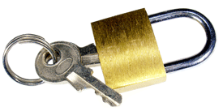

[How I'd Hack Your Weak Passwords](http://onemansblog.com/2007/03/26/how-id-hack-your-weak-passwords/) raises some **great questions about internet security**. I remember the day when people didn't run anti-virus on their computers which allowed someone to hack your computer in a matter of a few minutes. People learned very quickly that they need to install some form of anti-virus so they don't open back doors and lose all of their important information. Today, I believe we are in the same era in the area of logins and online identities. We can login into our insurance policies, bank accounts, social sites, etc. Places where if we let access of a predator in it could potentially mean devastation to credit as well as personal lives. In the coming years people will realize that they actually need to have numbers and characters in their passwords. Hackers are getting smarter, not dumber.

> "...people just don't care about all this until it's too late and they've learned a very hard lesson."

> Buckle your seat belt, keep all valuables out of your car, shred your documents, don't give out personal info online and now **learn to use strong passwords**. I am going to take my own advice now and start changing my passwords to something crazy. Maybe it will be fun?

