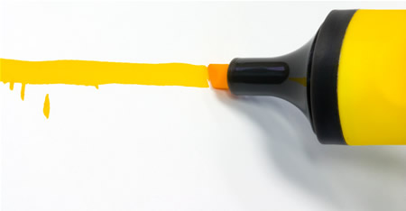

This year has been an incredible year on the career front. I literally can't believe how far I've come from last year. To put things in perspective, it reminds me of back in college when I was was failing calculus and then buckled down and **learned the entire semester's worth of calculus in an 18 hour stretch of time, receiving an "A" on my final.** This year has been like that. **I can't remember a single year of my life that I have learned so much as this year.** Thank you to everyone who has helped make this possible, thank you.

Some of the this year's career highlights:

- I met a lot of great people where I work at RMG Connect. I got to lead UI development on some pretty big projects, and was the third to receive our internal company, "Rockstar" award.
- I launched this website 8 months ago (late April), all of it being hand written 100%from scratch. Since the launch, it has received 300k page views and grown to 15k unique visitors a month.
- I learned how to successfully code open source projects - helping thousands of developers around the world is worth its weight in gold.
- I gave two presentations at jQueryCamp, held on the Harvard campus.
- One week I was [featured on Ajaxian](http://ajaxian.com/archives/ajax-experience-tutorial-sessions) and [Smashing Magazine (jQuery Calendar)](http://www.smashingmagazine.com/2007/10/23/online-calendars-and-date-pickers/), sort of an epiphany that people are noticing and really do care about what I do.
- To top off the year, my code is now being [used by Google](google-uses-ui-datepicker).

### Looking Forward

I have goals and a plan for this website in 2008. I have so many things I want to do it is crazy, but I just need to keep things into perspective and it will be another stellar year. Thank you for watching, reading, helping and supporting me. Without the help and contributions of others I wouldn't have much, so thank you again. Here is to another great year in the horizon!
