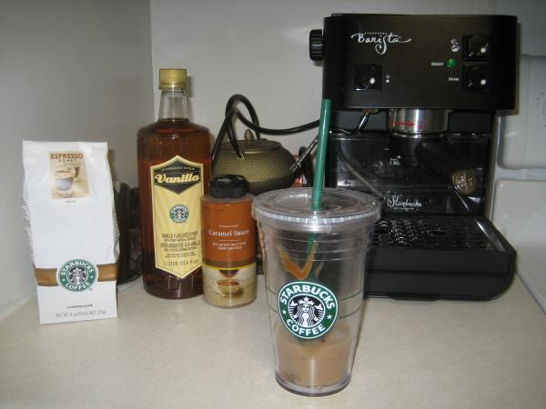

My favorite drink in the world (at the moment) is a caramel macchiato from Starbucks. Since I'm consulting from home these days, I thought it would be a great idea to make my own caramel macchiatos.

So I picked up what I needed:

- Starbucks Barista Espresso Machine off craigslist for \$150
- Carmel sauce, espresso grounds, vanilla syrup for about \$15
- Double insulated cup for chilled drinks for about \$13.

After a couple screwed up drinks, I finally got the right combination of espresso, milk and vanilla syrup.I can make it without leaving my house and it tastes just the same, if not better since I control the proportions.

Web devleopment from home just got even better thanks to you, **Mr. Starbucks Barista Espresso Machine** !

> Note on June 27th, 2008: Rammi asked for my recipe, so here it how I make it - adjust to your liking:

- ~1 tbsp of vanilla flavoring syrup
- 8-10 oz of milk
- 2 shots of espresso
- carmel sauce

Drizzle caramel sauce in the bottom of the cup. Pour in ice, milk and vanilla flavoring. Make 2 shots of espresso, emptying the espresso grounds and fill it up with new grounds for each shot. Drizzle more caramel on the top of the drink after you add the espresso.
