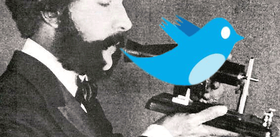

> ["I'm shifting from RSS to the live-web [Twitter]" - Minnov8 podcast: episode 36](http://minnov8.com/2009/05/09/m8-gang-podcast-episode-36/)

Another person on the podcast even quoted:

> "The internet seems to be shifting to the live-web instead of blogging"

This comment fired me up a bit to tell you that **Twitter is simply a new form of communication. New methods of communication encourage the others, not destroy them.** Finding out about Twitter is like when people found out about the telephone. Telephony is a method of communication that bridges the gap between actually physically having to be in the same location. Overall people are able to meet up by talking on the phone first, expanding their communication. In this same way, Twitter bridges another gap of instantaneous communication between blogging and emailing.

### Blogging and (e)Books are Here to Stay

Other types of communication are not going away. Blogging, books and e-books, major publications, etc are all forms of communication that will more than likely actually increase with the advent of micro-blogging.

- Major publications will always exist because we, as humans need an"authority"to trust in each topic. Someone who really knows their stuff in the midst of the sea.
- Personal blogging will continue because we need a place to gather our thoughts into a (semi)thought-out format that is publicly consumable.
- Books will stay because we need deep, thorough and comprehensive content covering various topics.

### Twitter's Invention, Micro-Blogging

In late 1800's, "What is the Telephone?" was the question. After the invention of the telephone, more communication actually took place. As the internet continues to grow, we are learning new forms of communication with each other and asking similar questions, "What is blogging?" "What is Twitter?" Instead of what is twitter, the real question should be, "What is micro-blogging". Twitter was the one to captivate the majority of people using micro-blogging, so this becomes the saying, "Kleenex" instead of saying what it is, facial tissue. Twitter's underlying principle is actually [micro-blogging](http://en.wikipedia.org/wiki/Micro-blogging). Micro-blogging is obviously a short version of blogging limited to a set amount of characters (140 because of SMS capabilities).

### Hyping the New Telephone

The current hype of Twitter is a result of people finding out about this new form of communication. It encourages them to get involved with a low barrier to entry. This is exactly the same as when the hype of blogging was going on. The only difference between this and the hype of blogging is that blogging was not tied to a single service leader -- there were many (Blogspot, Blogger, Typepaself-hosted, etc). With micro-blogging people have a single source to direct their attention to, hence the major hype on Twitter with the only occasional mention of **the real invention, micro-blogging.**
