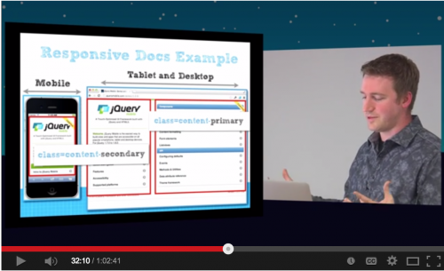
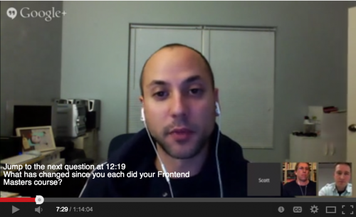

In 2013 I gave 7 talks, 3 videos and wrote 4 external articles (...and [tweeted](http://twitter.com/1marc) 3,516 times). I spoke at: [Fluent Conf Online](http://oreillynet.com/pub/e/2969), [JS Day Italy](http://2013.jsday.it), [Minnesota Developer's Conference](http://mdc.ilmservice.com/), Clockwork JavaScript, MinneBar, [MN Web Design](http://www.meetup.com/mn-web-design/events/95185932/) and [JavaScript MN](http://www.meetup.com/JavaScriptMN/events/128471632/). Most of the talks I gave were local to Minnesota because my wife and I had our _first_ baby and I want to stay close to home. :-) Here are the links to the [slides](http://marcgrabanski.com/web-development-talks-2013/#slides), [videos](http://marcgrabanski.com/web-development-talks-2013/#videos) and [external articles](http://marcgrabanski.com/web-development-talks-2013/#external-articles) I wrote in 2013...enjoy! h2(#slides). Talks I Gave in 2013: h3. Slides on Matrix Transforms, SVG, jQuery Mobile and Paid vs Free Content \[mgslides id=27707793\] [CSS/SVG Matrix Transforms](http://www.slideshare.net/1Marc/css-and-svg-matrix-transforms) \- contains demos on matrix and matrix3d proprieties the low-level transform API. \[mgslides id=12708775\] [SVG and RaphaelJS](http://www.slideshare.net/1Marc/svg-and-raphael-js) \- introduction to SVG (Scalable Vector Graphics) and overview of RaphaelJS. Also includes some other projects in the end. \[mgslides id=12708778\] [Introduction to jQuery Mobile - Web Delivery for ALL](http://www.slideshare.net/1Marc/jquery-mobile-12708778) \- talk covering the benefits of the jQuery Mobile project. \[mgslides id=21614912\] [Free vs Paid Content](http://www.slideshare.net/1Marc/open-sourcebloggingfreevspaid) \- covers the death of my personal free work and how I'm building in sustainability into my efforts now. h2(#videos). Videos I'm in from 2013: h3. Videos of my talks on jQuery Mobile and SVG as well as a Q&A with jQuery Team Members p=.  [Introduction to jQuery Mobile - Web Delivery for ALL](http://www.youtube.com/watch?v=DIA4qJCTeYI) \- video of my talk covering the philosophy and reasons for using jQuery mobile. p=.  [Fireside Chat with Karl Swedberg and Scott Gonzalez](https://www.youtube.com/watch?v=5426AbD7-z0) \- G+ hangout video covering questions and answers all things jQuery with Karl and Scott LIVE with questions asked by Frontend Masters members. p=.  [SVG and RaphaelJS](http://www.youtube.com/watch?v=ECUhNrlyTkE) \- Introduction to SVG and RaphaelJS - video of my talk on SVG (Scalable Vector Graphics) and RaphaelJS API. h2(#external-articles). External Articles I wrote in 2013: h3. Backbone.JS Rendering Perf, 5 Reasons to Use jQuery Mobile, Paid vs Free Content and Why I Choose Front-End Development * [Backbone.JS Rendering Performance](http://blog.sprint.ly/post/42929468986/web-ui-rendering-performance) \- article I wrote advocating batch DOM rendering on requestAnimationFrame for high performance rendering. * [5 Reasons to Use jQuery Mobile](http://www.creativebloq.com/jquery/five-reasons-use-jquery-mobile-4135691) \- article I wrote for .NET magazine (now Creative Bloq) which is a spin off of my talk on jQuery Mobile. * [What I learned from building a career driven by an “everything should be free” idealism](https://medium.com/what-i-learned-building/be97720fedee) \- article along the lines of the talk I gave on paid vs free content. * Quora answer to ["Why did you choose a career in front-end or back-end development?](https://www.quora.com/Web-Development-Why-did-you-choose-a-career-in-front-end-or-back-end-development/answer/Marc-Grabanski)