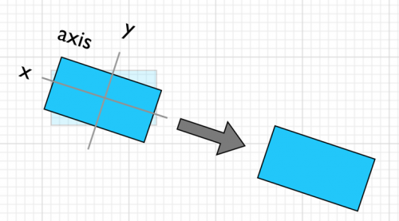

The HTML5 vs native OS performance debate simply will not die -- and for good reason! **We currently don't have the API we need to build fluid animations on the web.** Before you go and put me on a stake, let me explain. Through this article I will make the case of why what we currently have in the browser for animation is limited, and try to clearly point out limitations and how JavaScript animation engines are leading us towards a better world that I hope gets built into the core browser UI rendering engine API.

## The Problem with CSS Animation Easing

CSS Animations are getting faster, but they are very limited in nature. CSS Animations are linear in nature. Adding a easing between two linear points is like putting makeup on a pig. _Applying easing in and of itself doesn't make something fluid._

## Easing Isn't Good Enough

Easing doesn't compose. You can't take the current velocity and direction and then compose that with easing to a resulting position. Instead, CSS Animations feel totally robotic in practice, even after adding easing. The result is that everything we currently have on the web is robotic boxes moving around. Ick!

## Physics-Based Rendering Engine

[Famo.us](http://famo.us) is the latest entry to the scene to give us a complete, physics-based rendering engine in the browser. The demos are incredibly impressive! Go check out the [demos](http://famo.us/demos) if you haven't already. They are able to do incredible organic-feeling, fluid, composable animations in HTML5 that no one else can do. This is because animations and layout composes to a resulting frame rendered in a targeted 60fps.

[Try it on CodePen](https://codepen.io/befamous/pen/kbxnH)

Let's go under the hood...

## Matrix Transforms

The matrix transform API is the lowest-level, cheapest way to move things in DOM -- matrix3d is the CSS style property for it. It is a 4x4 matrix that tells the browser where to move, rotate and scale something in X, Y and Z space. It's basic linear algebra. You did pay attention in grade school...right? **wink wink**  Side note: I have a slide deck here that goes more into matrix3d and other related stuff: [mgslides id=27707793] You can also [play with matrix3d](http://www.eleqtriq.com/wp-content/static/demos/2010/css3d/matrix3dexplorer.html).

## Famo.us + Matrix Transforms

Famo.us uses the concept of a render tree which outputs the resulting matrix3d to a DOM node. Composing matrices is fairly cheap... and output the resulting matrix is fairly cheap as well. People think Famo.us is canvas or WebGL...WRONG. It's just plain DOM. You aren't writing DOM...you're writing to their rendering tree which outputs DOM and then modifies the DOM position using matrices. The rendering tree composes a resulting matrix and spits it out into the DOM on each frame. Side note: I think Green Sock can do this as well. That guy was the king of Flash animation and moved his library over to JavaScript. As far as I know, Green Sock and Famo.us are the only libraries that can compose tweens togehter with added directional physics and spit out a resulting matrix in each frame using the lowest-level API for moving things...matrix transforms.

## Famo.us Physics Engine + Matrix Transform

Famo.us also lets you take the directional velocity of a mouse flick and allows you to compose that velocity into an animation which ends up at a certain point. It makes a fluid animation by composing on easing, velocity and direction and outputs the result of where that thing should be at each frame in the 60fps. If each frame takes X milliseconds, it would know how many milliseconds has passed between frames and then calculates the resulting matrix for each frame and spit it out into the DOM node's matrix3d style property. Simple...right? ;-) Here's a demo that when you click on the disc it adds velocity in that direction. Try clicking on the top right and then the bottom left. HTML5 itself just can't do that. You need an engine that can take the current state and then apply a force to it to change the current velocity.

[Try it on CodePen](https://codepen.io/befamous/pen/eAlwd)

This post isn't about Famo.us though -- it's a call to arms for real animation engine. Not some tween-between-two-linear-points crap like we have today.

## Transform API

Let me get into the next thing you need to understand before my proposal, which is transforms themselves. The way the transform API works in CSS (and SVG), is it composes a resulting matrix under the hood (sound familiar?). So in CSS if you say. transform: rotate(45) scale(1.25) under the hood of the browser it's going to make the resulting matrix3d and move the element in a cheap way through applying the resulting matrix3d frame-by-frame. That's why Famo.us isn't some wizardry-warlock-magic-dragon-vomit, it's just manual-mode matrix transforms under the hood. Famo.us is just re-implementing the same matrix transform API under the hood as the browser does itself! Do you get my point here folks? **It's matrices all the way down!** Transforms compose into a resulting matrix. Linear algebra baby.

## Composable Transform API

One of the main issues with the transform API is it's singular way of composing them together. You can, as I showed before, compose rotate(45) scale(1.25) translateX(50) into one resulting transform. But that way compose is kind of weird. Every time you add a rotate before a translate, the rotate modifies the original axis origin. So if you rotate(45), then translateX(50), instead of it going 50px to the right, it goes down and to the right. See my little graphic here: 

### Demo of Composing / Stacking Transforms

In this next demo, I show you how you can compose transforms so you can play around yourself. This is a basic demo of how transforms "stack" on top of each other and modify the original origin of the transform. For instance, if you add a rotation transform and then try to add a translate transform on top of that, "x" may not take you left and right anymore, but in a different direction based on the axis of the rotation origin.

[Try it on CodePen](https://codepen.io/1marc/pen/DCvFm)

This isn't ideal because you have no idea what the results of this transform is. You can stack eight different transforms together, but if you try to move it right...well, it won't go right unless your axis has never been modified!

### Stacking Transforms with RaphaelJS

With RaphaelJS, you can do the same transforms as before, but you can make "absolute" or "relative" transforms. So using absolute transforms makes it explicit what you are doing to modify your object instead of it stacking on top of the prior transform. If you want that damn thing to move right after a rotate, you'll be able to do it with Raphael's absolute transform. Again...the power of matrix math!

[Try it on CodePen](https://codepen.io/1marc/pen/rsmbF)

Also, not shown in the demo, RaphaelJS  has convenience methods like "element.matrix.split()" to get the current resulting transform stack and "getBBox()" to know where your object is now. Current transform API has nothing like this other than getComputedStyle. Which if you've ever used getComputedStyle... you know it's not enough. You'd have to getComputedStyle, break the matrix apart with matrix math and then modify it. Ouch.

## Tweening

The concept of tweening I first learned back in the Flash days. You could "tween" between two sets of properties and add easing to move about between animation states. Flash had some of the same issues I illustrated above, but then tweening animation libraries came along like GreenSock. The browser tweens between two points natively with CSS transitions. You specify a transition duration, change the properties and BAM a tween happens over that given duration between the two properties. The problem with this is there's no way to change the animation mid-stream. If you set a new animation it's not going to fluidly transition, it's going to restart. Again...ick. That's where GreenSock steps in. You can know where the object is at all times because you set it manually through the tween library.

### Browser Tweening with CSS Matrix Transforms

Once you have a matrix transform, you can use the transition property to animate the transform matrix with CSS.

[Try it on CodePen](https://codepen.io/1marc/pen/FJbtj)

### Tweening with RaphaelJS Transforms

You can use the .animate() method built into RaphaelJS to tween between transforms. We're also using the built in "elastic" easing method when we clear the transform. I like it because you can use absolute or relative transforms and Raphael interpolates between states for you.

[Try it on CodePen](https://codepen.io/1marc/pen/zqJba)

### Using the XCSSMatrix Library to Modify a Matrix Transform

John Schulz has made the XCSSMatrix library which lets you take an existing matrix and modify it with various transform methods (sort of like RaphaelJS does). You can then use the native CSS transition property to animate the matrix like we did in a previous demo.

[Try it on CodePen](https://codepen.io/1marc/pen/BdAvt)

This is a lot closer to Famo.us in that we are modifying the matrix3d in JavaScript and then outputting the new result in every animation frame. Ideally we would be calculating timestamp between frames and using that as a key in our timeline, but here I did it the naive way just to illustrate the concept.

## What We Need

So far we've covered CSS Animations, easing, matrix transforms, composing transforms, tweening, manually tweening matrix transforms with JavaScript and requestAnimationFrame. **phew** -- still with me? What we need is a new animation API: - it can tween between two matrices - it will allow you to compose transforms in an absolute or relative way - it will let you compose tweens -- modify where it's going and transition between them with physics - it will allow you to compose tweens mid-animation with physics - it will take direction into account and allow you to apply force to the animation with physics properties - it will allow you to query the current properties of an existing tween (or set of tweens) There is a new initiative to create a [Web Animations API](http://www.polymer-project.org/platform/web-animations.html), but I'm not sure it covers all the cases in this article. Though, it looks like it's a step in the right direction. So for instance. If you're going right at a velocity of 30px per second, and you add a downward force, it should arc downward...not just go straight down and then lose that velocity over a given time reduced by friction (or decay). All of this is explained in exquisite detail in [Animate Your Way to Glory](http://acko.net/blog/animate-your-way-to-glory/) by Steven Wittens. I'll add that Facebook paper uses its [pop animation framework](https://code.facebook.com/posts/234067533455773/introducing-pop-the-animation-engine-behind-paper/) which has spring, decay and custom easing which accept velocity as input. It is a basic physics animation engine for animation. We need something like that on the web built into the web browser. .embed-container { position: relative; padding-bottom: 56.25%; padding-top: 30px; height: 0; overflow: hidden; max-width: 100%; height: auto; } .embed-container iframe, .embed-container object, .embed-container embed { position: absolute; top: 0; left: 0; width: 100%; height: 100%; }

## GreenSock Thoughts

GreenSock I think does some of the above... but I haven't looked into it too much. I need to look into it more. Here's a shiny demo of GreenSock in action with some pretty nice animations. The thing that's missing from it is physics. We have the problem in this animation of it looking pretty linear and robotic.

[Try it on CodePen](https://codepen.io/A973C/pen/gnHrJ)

Here's a demo site of [using 2d physics in GreenSock](http://www.greensock.com/draggable/) ...so I think it has to be possible to do some of this physics-tween stuff with GreenSock.

## Famo.us Thoughts

I like the results of the Famo.us rendering tree approach! It's amazing what the engine can do...but on the downside it doesn't feel at all like web development. It's kind of like Sencha in that it takes over the entire UI layer and says "give all the things to me" and doesn't let you feel like you're the one controlling the engine at all times. I think the fake scrolling (which Famo.us has to do) stutters on retina on my iPhone on their current homepage. It's not ideal, but I'm sure they'll fix stuff like that in the future.

## Parting Thoughts

What I'm really asking for is a physics-based tweening library built into the browser. Not just putting lipstick on a pig by tossing in easing to linear CSS animations and calling it quits. GreenSock and Famo.us offer a glimmer hope for the future of web development and I'm sure we'll see many more to come.
