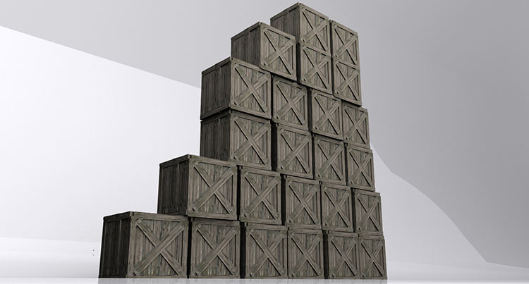

Likely many of your projects have died due to lack of keeping the momentum going and growing. Momentum is precious. It's the life force. **Learn to manage momentum and harness it. By doing so you will drink of it's sweet nectar of glorious fuel for your project to grow.** Momentum is the most precious ingredient that keeps moving projects, companies, weight-loss, or whatever your goal is forward.

## Look for the Little, Daily Wins

The best advice I have to build momentum and do great things is to look for the little successes and build on them. **If you see a little success, keep it going!...for god's sake, keep doing more of that thing and keep those little successes growing!** Little, no scratch that, _even tiny itty bitty_ successes build up into BIG things. String together those tiny wins and you'll see something big starting to grow.

## Don't Switch

In my life I've had so many things I started. Some of them started to see success. Even with success piling up... as soon as I switched -- it died (even if slowly).

**Moving away for large periods of time to focus on other things absolutely kills momentum.** By switching focus, you pretty much killed the previous project with a horrible death. You'll notice when you come back to it the wind is gone, or the wind is dying out. The myth I used to keep telling myself when switching projects is that I'll, "get back to later". _It never happens...once you quit, you quit!_ Then you'll be staring back at that thing in a "what if" scenario.

## Learn to Bury Your Old Projects

Once you lose momentum from switching, it's hard if not impossible to get it back. **That old fire is hard to rekindle.** If the fire is out, you might as well bury that old project. _Even if you spent years of your life on the project_ like I have on some projects. Sometimes I look back on them today and say, "well, what if I just went back to that thing?!" Well, there was a reason I stopped...right? And **if it was my best idea ever, I probably wouldn't have stopped.** On shark tank **when people get up on stage with an old idea they haven't touched in years they don't get funding.** Rarely, if ever, will a shark ever do anything but a licensing deal with someone who pulls out something old. They'll take the technology and license it to a bigger player rather than trying to build a business with it. The momentum is gone, so they view it as something dead they might be able to squeeze money from through licensing.

**Learn to just kill those old projects and don't play mind games with yourself that you'll get back to them someday.** Trust me, it'll relieve so much stress in your life if you stop having so many thing you think you should focus on (including old projects). _Learn to just focus on the project at hand._

## Snowball Momentum

So what's the reason I like focusing on one project at a time now as opposed to 3-5 at a time like I used to? **Working on one project/mission is all about snowballing momentum.** What do I mean by that? Well, once you get a small snowball moving forward it picks up other snow and becomes a bigger snowball...and if you keep it going...well, it could could become an avalanche!

**The bigger project starts rolling up things underneath it and the whole thing continues to grow bigger on that combined momentum.**

## Momentum is King

**Managing momentum is probably one of the biggest tricks to keeping things going and something you need to learn to harness to fuel you to achieve your dreams.**
