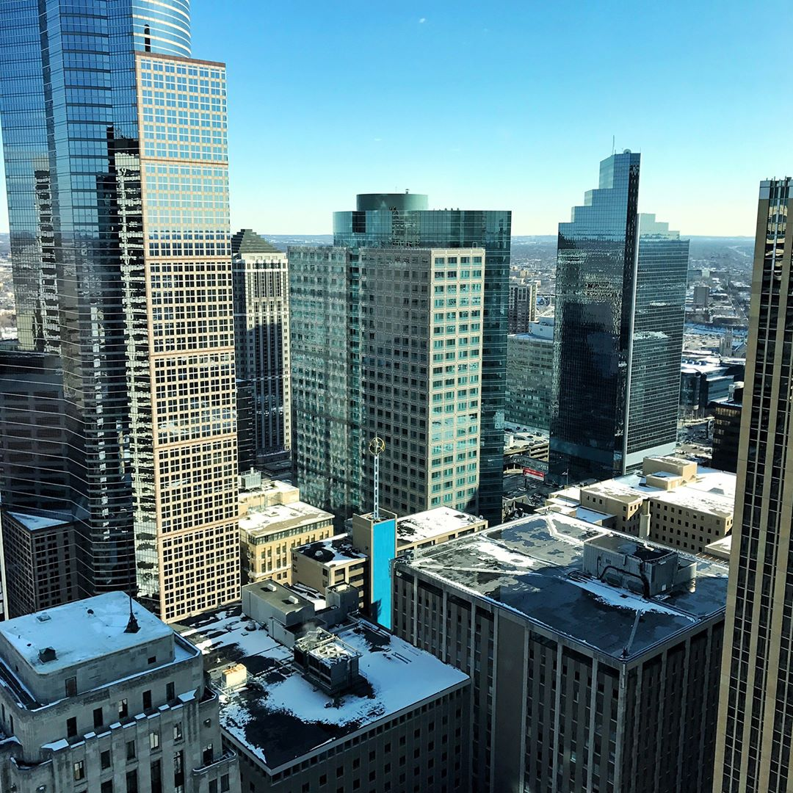

## 2017 was the year I built a team of amazing people

We are small, but incredibly effective. The 7 of us -- 5 full time and 2 contractors. We are **all focused together on one mission together: improving the state of (professional) education**. We are all working together on [Frontend Masters](https://frontendmasters.com), where **50+ teachers share their experiences and knowledge with tens of thousands of software developers**, making an impact on their careers and their life's path.

## We Moved to Downtown Minneapolis!

We moved towards the top of one the the most beautiful buildings in downtown Minneapolis in RBC Plaza. We signed a 6 year lease. We moved downtown to open up our workshops to everyone in Minnesota (not just the south suburbs) and have an inspiring space for both teachers and students to learn and grow.

## Thinking Daily on Building a Team Last year (2016)

I had a team of 15-20+ contractors doing a variety of tasks. Everyone was great, but I realized that in order to go to the next level, **I needed to find a few all-star people to take a holistic view of the company and make fundamental changes to the business every day**. I needed to put 100% of my focus and money on building a team. Focusing daily on building the team and learning what makes a great team is where most of my brain cycles have gone this year. Very happy about the results so far -- time well spent!

## The Magic of a Team

It feels magical to have all of us using the fresh parts of our day working together innovating and pushing the product forward. Everyone now is on vesting schedules owning part of the business and sharing in the vision of the company. I no longer have to repeat myself getting contractors onboard and **the team is full of energy and excitement towards moving everything forward**. We've been at this for over a year together now and doubled the revenue of the company putting us in a stable financial position to launch off of in 2018.

## Looking Back: Hiring Contractors

In the Early Days Our needs were seasonal -- we recorded workshops only 3 months for the first few years and didn't need ongoing help. Hiring contractors, even if they were expensive, cut costs and **helped me retain equity over the first few years while I proved out the product.** Over time though as the business was proven out, contractors became much more expensive to hire ongoing than having a tight, focused team working together day after day.

## Starting a Business: Choosing Contractors or Employees

To start, you choose: - hire employees and give them quite a lot of equity to join you to de-risk the business in the early-days. - OR pay contractors a premium. Contractors just have to trust that you'll pay your bills in order to work with you. Your job, in the early days, is to **de-risk the business and prove that your product works in the market**. _You either have to give employees a lot of equity, or pay contractors a premium._ I chose to work two contract jobs in order to afford to pay the contractors and retain equity in the business.

## Transitioning Away from Contractors to Vested Full Time Employees

In 2016, the business really started to take shape. I was able to afford running workshops for most of the year. But there was this sinking feeling when I was paying top dollar for multiple years hiring a team of contractors but _wasn't seeing any big changes happening in the business to move us forward_. Contractors were good, but also were happy to do "the same old thing" for years and get paid a premium without actually changing anything in the business underneath the hood. **There were no fundamental shifts or innovations coming from a team of contractors, so I needed to transition to vested employees.**

## Overview of the New Team! (Hired Late 2016/Early 2017)

We hired a **CTO who has replaced most of our old broken systems** that were hacked together in the beginning of the company to figure out the core product. We have a really clean foundation now to build and innovate on top of. There is one main system left to replace, and once done will open up tons of new doors for us for innovating on the new system.

- We hired a **Chief Product Offer** who has completely revamped our production process and rebranded the entire product.
- We hired a **VP of Publishing** who has been pushing forward on marketing campaigns and social media, getting us up to speed on production, planning out the new season of workshops, bringing in new teachers ...and more!
- We hired a **VP of Video Production** to make our awesome story videos, promo videos and course video production. He's been able to shoot high quality shorts and process a ton of video with an awesome look and feel.
- Our **Lead Front-End Engineer** (working on contract nearly full time) who has actually been with us for over 5 years. He built the new video player UI experience from scratch.
- We have a **Lead of Customer Success** (working on contract nearly full time) who onboards new customers helping them chose the right courses for them and taking care of any support questions.
- I have been **learning my job as the CEO**. In the early days of a company it means "Chief Execution Offer" meaning you pretty much have to do everything. As we've been hiring people who can cover areas better than I can, I get to defer decisions to them and discover my new role. I view my primary objective as making sure the team, customers and teachers are all happy. That takes a variety of shapes throughout the days, but as long as those three parties are continually happy, the business continues to grow. That's our entire team! 7 people running a multi-million dollar company. Well, it's us and our network of 50+ amazing teachers.

## Improving My Health

In 2015 my metabolism started to drop and I went in to measure my body composition. 28% body fat! Embarrassing to me since I was skinny all of my life. I tried running a lot but it didn't seem to help. Eventually I got a trainer and started lifting weights twice per week. In less than 6-12 months I got down to 17% body fat and was able to deadlift 375 lb and squat 285 multiple times. Pretty happy with that. Overall I've shed around 30 pounds of fat and put on like 40 pounds of muscle. Pretty dramatic change in body composition. All I'm doing is **lifting weights twice per week for about 30-45 minutes, but it's made all the difference in the world health-wise**.

## Crypto Currency

I got super fascinated with crypto currencies this year and started investing about mid-way through the year. It's something I've been on the sidelines about for 5 years but decided to finally dive in head-first. I'm excited that you have a trust-system built on mathematics, and how that can change the fundamentals of how we exchange money and code applications.

## Onward!

In 2018 I'd like to:

- **Business:** Grow at least 2x again= by trying out marketing experiments and making major innovations / breakthroughs on the core product. We need to focus a lot this year on growth and innovation. Ideally growing out the team by at least 2-4 more people.
- **Fun:** Plan out some group activities for my extended friend network to meet each other. In 2017 I setup a 15 person paintball outing that was a ton of fun. I need to do more of this type of thing!
- **Family:** Plan out more vacations and key fun things I want to do with my family. I haven't been great at planning in advance for family stuff. I'd also like to re-connect with some of my extended family.
- **Health:** I'd like to get back down to 15% body fat and continue to grow lean muscle mass in a sustainable way where I can keep in shape for the longterm. Cheers and thank you all so much for the support and love! I really feel like a lot of people are cheering us on to continue to improve how we can better learn professional skills.
