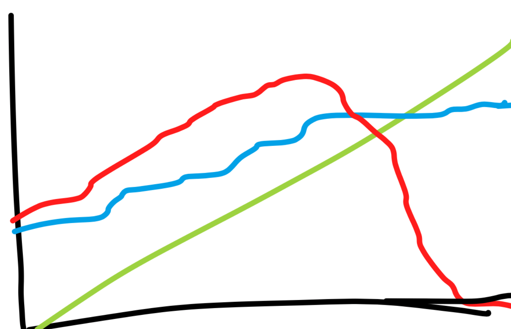

## Building a "Dream Team" Environment

**Most of what I've been thinking about these days is continuing to grow and build an amazing team.**

Some things teams need:

- To be an active contributor to something bigger than yourself, and connect to the overall mission of the company.
- To be growing each day and be surrounded by people that are encouraging you to grow.
- To be in a financially secure environment.

That last one, "financially secure" has been an issue in the early days... even until early 2018. The team needs to feel secure and stable if they're going to view working at the company as a viable career option – and not just a temporary gig to add to their portfolio like many job options out there.

## Becoming Debt Free and Financially Stable

**Frontend Masters was incredibly expensive to get off the ground.** On top of the normal labor costs that software companies have, we also had:

- Video and production equipment
- A physical office space to record workshops and host 10+ attendees
- Pay speaker and appearance fees
- Long production cycles to produce the final product (this means the pay-off on the investment isn't immediate)

On top of all of this, the business is subscription-based, and a subscription is a more difficult purchase decision for a customer to make vs a one-off product. It can take a long time and effort to gain enough subscribers to get over the fixed costs it takes to run the business.

### I'm Happy to Report We're Financially Stable, Debt-Free and Continuing to Grow

I've carried a lot of debt since I started the business for the reasons listed above. But the growth was always out-pacing the amount of expenses, so I planned that at some point, we'd cross the gap of profitability to be able to support our current efforts.

Forgive me for this terrible over-simplification of a sketch:

This chart shows 2013-2018 at a very high level

**Operating Expenses** (blue)
**Debt** (red)
**Revenue** (green)

It was stressful carrying the debt around, I'm not going to lie. 😱 Having a mountain of debt while getting married and starting a family is not a good feeling. Many companies get VC money for this reason.

...but on the other hand....**now we're debt-free, bootstrapped, and profitable. ✨ And no one can tell us what to do or not do while being financially independent!**
