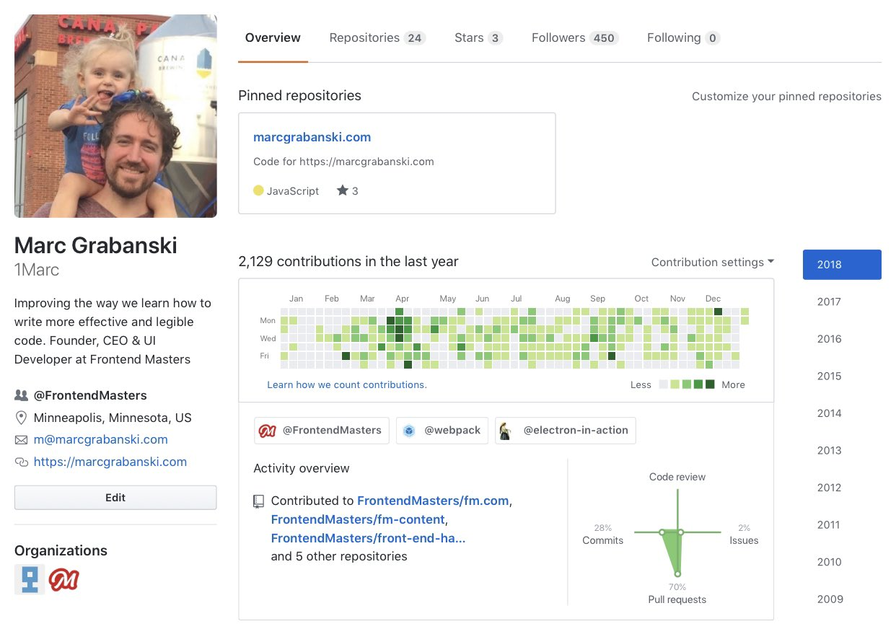
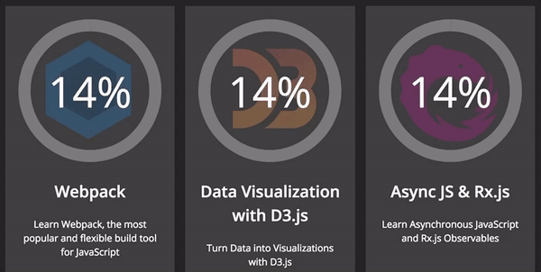
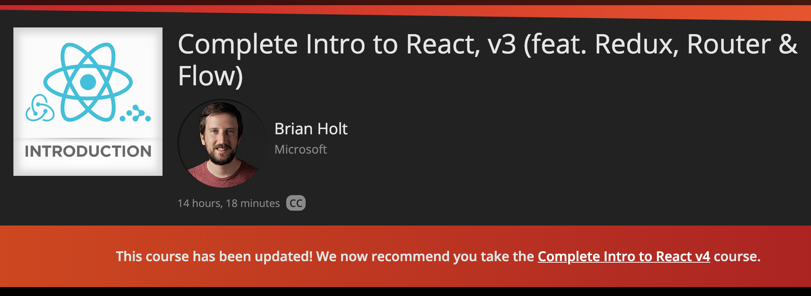

In 2018, I managed to write **a lot more code** – 2,129 commits total.

Much of this code was on the [new Frontend Masters](./new-frontend-masters-website) website.

## Features I Coded in 2018

- [**Learning Paths**](https://frontendmasters.com/learn/) — We put all our courses into a cohesive order according to peoples' learning goals. There was also a fun SVG progress widget I built from scratch which was a blast to code!

- **Course statuses** — An issue with updating courses is that people were taking the old versions. We added this status indicator at the top of old courses to make sure old courses are pointing to the updated course.

- **Bootcamp Website** – The largest project of the year was putting together a two-week bootcamp to take beginners from nothing all the way up to having autonomy and taking control of their learning. By the end, they were able to code their own projects. I built a sub-website around this project.
- **Promotional Websites** - Every spring and fall we have a new theme for promoting the things we're building. We launched an [updated iOS app](https://itunes.apple.com/us/app/frontend-masters/id1383780486?ls=1&mt=8) and a [new Android app](https://play.google.com/store/apps/details?id=in.mjg.frontendmasters.store&utm_source=frontendmasters_com&pcampaignid=MKT-Other-global-all-co-prtnr-py-PartBadge-Mar2515-1) (which I had nothing to do with), but what I did do was build both of the sub-sites for the promotions.
- **Annotations** - One issue our users were having was keeping the code in sync with our courses. So we addressed this by popping up git commands and code snippets within the player. They’re super helpful. Was a blast to be able to take a stab at and get out to the public – this has been on the roadmap for years!
- **Static Pages SEO Revamp** – Our build process takes markdown content files and puts it in a data format for Hugo to generate the static pages. I revamped that build process to spit out more SEO-friendly pages, and increased our search traffic by a non-trivial amount.
- **MarcGrabanski.com** – Moved this site to Gatsby! The [code is up on Github](https://github.com/1Marc/marcgrabanski.com). The most difficult part of the migration was getting the old WordPress posts into a proper markdown format. I tried to hire some help on Upwork...but that didn't go so well. I did write an importer, then from there I clean up the remaining items with some pretty intense regex. Nice to have a blog again... I couldn't get myself to write when it was on WordPress. 😂

## 😍 Loving Code 15 Years In

Super grateful to the team for affording me the time and space to write some good code for the company. I realize as a CEO, I may not be able to keep writing code over the long-haul, but damn is it fun when I can get a chance to!

We’re only two weeks into 2019, and I already revamped our Gulp build process...starting the year out strong! 💪
