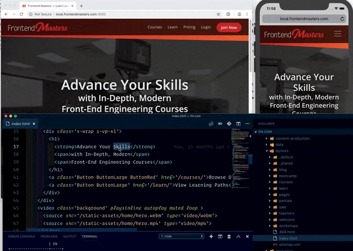

In 2018, I managed to write **a lot more code**, mostly on the Frontend Masters site: 2,129 commits!

This was mostly thanks to our new team enabling me to work on the site, combined with the new stack our team built being an absolute pleasure to work on. We built the system with developer experience in mind, plus it's built for performance and is ⚡️ lightning fast!

## How We Made FrontendMasters.com So Fast

The fastest websites do one thing first and foremost: focus on delivering the HTML content. Plus they aren't blocked by script parsing, loading of styles, or 3rd party content. The new site is compiled static HTML files built with Go's static site generator, [Hugo](https://gohugo.io).

A static site generator just means that a visitor of your site is going to get a prebuilt HTML file served to them instead of rendering the template dynamically on the server, similar to what you get with WordPress out of the box.

From there, we modified Hugo to also be able to render templates on the fly, which enables us to reuse the same template hydrated with user data if the user is logged in.

**What we ended up with was a system that gives us the best of both the static site generators and dynamic server rendering worlds.** It serves the user static files if you're just visiting the site (which makes the ⚡️ site super fast), but if you're logged in, you get served those same templates with your user data rendered into them on the fly.

## Developer Experience

This system keeps our site fast, plus keep our development experience high by not having to have two separate systems for logged in vs logged out users. **One template to rule them all!**

We're using Webpack to build local file changes and BrowserSync to push those changes into the browser. This is such an amazing developer experience because it means I can have several different browsers open at different sizes and have them all update as I develop! 🤩

Plus developing the logged in vs logged out Hugo templates is super smooth as well since all of our data is stored in local YAML data files. These YAML files are what get replaced on the server when rendering the dynamic pages. If you want develop as if you’re logged in, is's as simple swapping a local YAML auth.yml file property `loggedin: true`.

## Code I Built with the Team

- **Learning Paths** — We put all our courses into a cohesive order according to peoples' learning goals. There was also a fun SVG progress widget I built from scratch which was a lot of fun!

- **Course statuses** — A major issue with updating courses, is people were taking the old versions. We added this status indicator at the top of old courses to make sure they're pointed to the updated course.

- **Bootcamp Website** – The biggest project of the year was putting together a 2 week bootcamp to take beginners from nothing all the way up to having autonomy and taking control of their learning in being able to actually code their own projects. We built a sub-website and course website around this.
- **Promotional Websites** - Every spring and fall we have a new theme for promoting the things we're building. We launched an [updated iOS app](https://itunes.apple.com/us/app/frontend-masters/id1383780486?ls=1&mt=8) and a [new Android app](https://play.google.com/store/apps/details?id=in.mjg.frontendmasters.store&utm_source=frontendmasters_com&pcampaignid=MKT-Other-global-all-co-prtnr-py-PartBadge-Mar2515-1) (which I had nothing to do with), but what I did do was build both the sub-sites for the promotions.
- **Annotations** - One issue our users were having was keeping the code in sync with our courses. So we addressed this by popping up git commands and code snippets within the player. They're super helpful, and I led that effort on the first stab at this. Was a blast to be able to finally do, since it's been on the roadmap for years!
- **MarcGrabanski.com** – And moved this site to Gatsby – [code is up on Github](https://github.com/1Marc/marcgrabanski.com). The most difficult part was getting the old WordPress posts into proper markdown format. I tried to hired out some help on Upwork...but that didn't go so well. It just ended up me having to use an importer and then clean up the remaining items with some pretty intense regex. Seems to be working find now!

## 😍 Loving Code, 15 Years In

Super grateful to the team for affording me the time and space to get some good code written for the company. I realize as a CEO, I may not be able to keep writing code over the long-haul, but damn is it fun when I can get my hands on code!

Also, we're only 2 weeks into 2019 and I already revamped our Gulp build process – starting the year out strong! 😝
