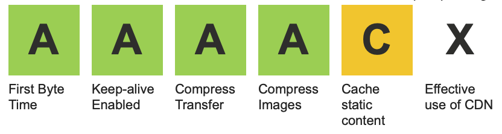

The new web stack we built is an absolute pleasure to work with. We built the new [Frontend Masters](https://frontendmasters.com) website and build system with two goals in mind:

1. Performance – it's ⚡️ fast!
2. Solid developer experience - the tools need to show your updates automatically.

## #1: Performance

Fast websites deliver the HTML content immediately and don't block this with script parsing, style loading, or 3rd party content. Our new website achieves this by serving compiled static HTML files built with Go’s static site generator, [Hugo](https://gohugo.io).

By using a static site generator, the visitors of your site will get served prebuilt HTML files. They don't need to be rendered on the server dynamically like WordPress does out of the box. With static generators, your sites are fast by default.

From there, we modified Hugo to render templates on the fly. This process enables us to use the same template we did for the static site but now hydrated with user data if the user is logged in.

**What we ended up with was a system that gives us the best of both worlds.** The site serves the user the static files if you’re visiting the site anonymously (which makes the ⚡️ site super fast), but if you’re logged in, you get the same templates rendered with your user data on the fly.

### Webpage Test Results

Overall our webpage test results are pretty good. 😀

There's more we have planned to improve performance, such as building the JS & CSS assets into Cloudfront and updating the caching rules on them.

## #2: Developer Experience

This system is not only fast, but also a pleasure to work in. We don't need two separate systems for logged in vs logged out users... we have **one template to rule them all!**

### Webpack and BrowserSync

We're using Webpack to build local file changes and BrowserSync to push those changes into the browser. This is such an amazing developer experience because it means I can have several different browsers open at different sizes and have them all update as I develop! 🤩

### Updating the Templates Based on Different States

Developing the logged in vs. logged out Hugo templates is super smooth as well since all of our data is in local YAML data files. These YAML files are what get replaced on the server when rendering the dynamic pages. Developing the logged in pages is as simple as editing the local YAML `auth.yml` file and switching the logged in property to `true`.

It's a lot of fun to work in and I couldn’t be more pumped about the new system…go, team!
