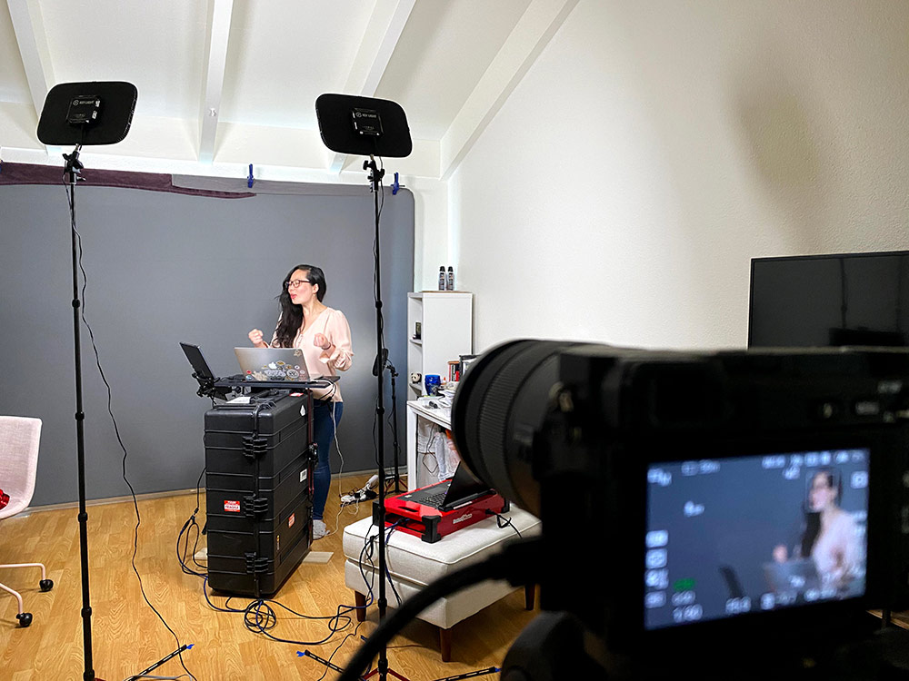
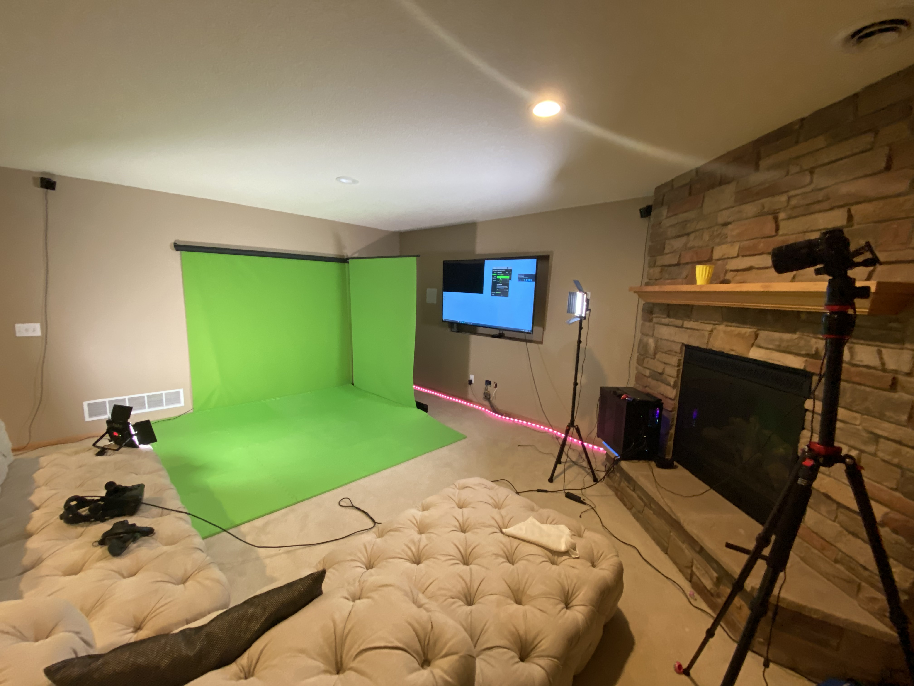
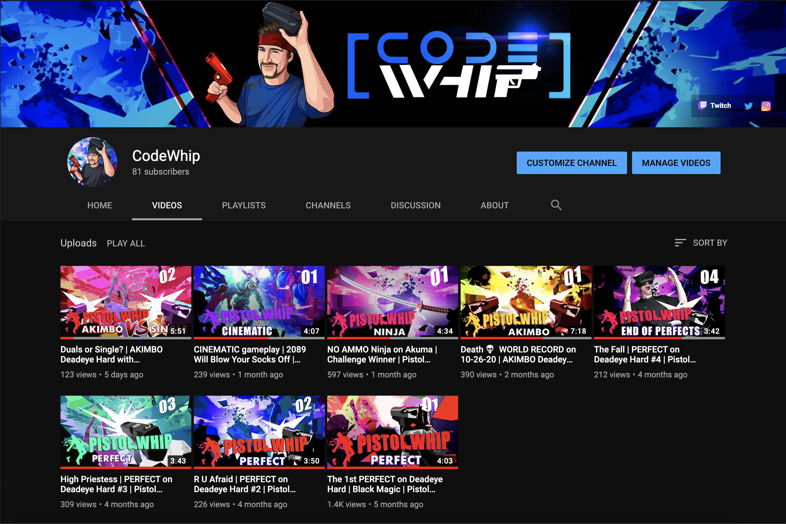
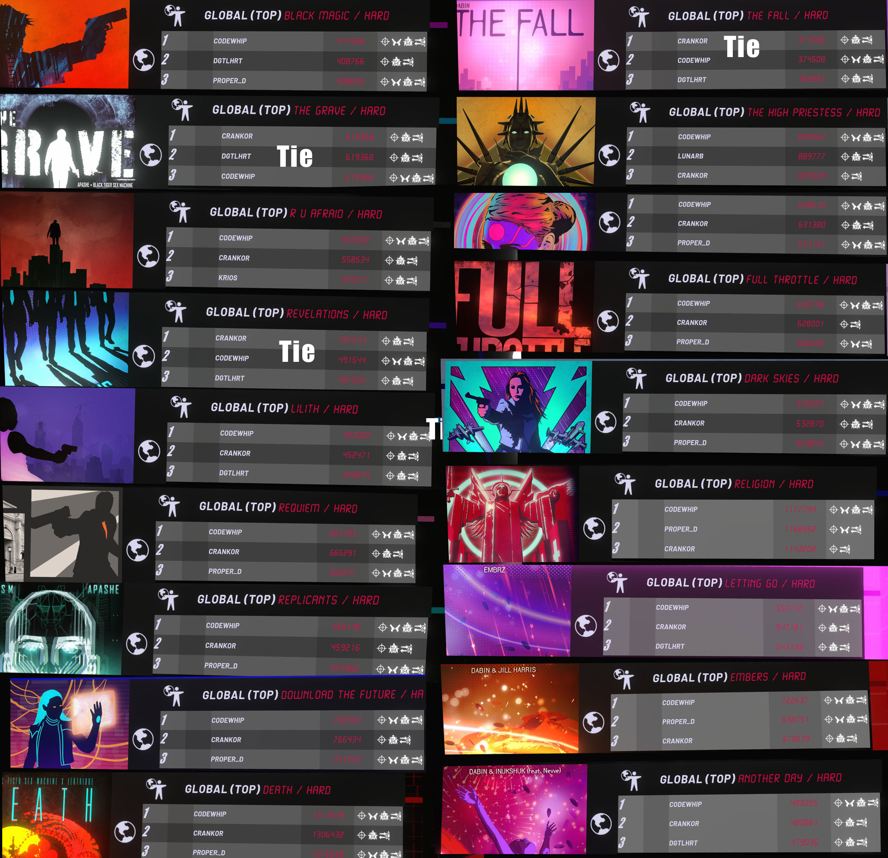

Here's a 2020 recap, but first Happy New Year! 🥳

## Going Remote (and Recording Remote)

In March, the whole world changed. Everything became uncertain as we had to pivot to going remote as a company. We managed through it amazingly well as a team and did incredible things pushing our abilities forward.

We rebuilt our entire recording process from scratch and created a remote video kit we can ship to instructor's homes or set up in remote locations:

We used this kit to setup in Denver and San Francisco. It's so cool to have a toolkit to setup anywhere! 🏔🏙

It's clear we're not going to work in-person anytime soon, so we have to adapt and learn how to hire remotely as well. I can't believe we're growing through this period, but despite the challenges, we have been able to overcome them and continue to grow.

Thanks to Aisha, Joumana, Brent, Krista, Lanie, Tanner, Jon, and Ken. I'm super proud of what we've accomplished together as a team! 🤩

## 🏃‍♂️ Running and Finding Virtual Reality

Along with going remote, I realized I'd be spending a ton of time around my house. At the beginning of the summer, I was running 4 miles at a time regularly – managed to clock in nearly 300 miles ran throughout the summer. But I knew winter was (eventually) coming, and needed something to do indoors.

Last winter I used an exercise bike, but upon browsing around I found streamers on Twitch sharing their Virtual Reality workouts and getting up to high BPMs. See this video for example where she gets up over 160bpm playing a videogame:

`youtube: https://www.youtube.com/watch?v=hEMvbFtitRI`

 It was time to buy a super-fast computer and a Valve Index and go all in! Pistol Whip turned out to be the game that rocked my world (what is shown in the video). I could play a game while sweating and getting a great work out in shooting and dodging bullets! SO, so fun. 🥳

## Mixed Reality Videos on YouTube

If you watched the video I linked to above, you'd see the real camera footage is suplanted inside the videogame. The first time I saw this, it blew my mind. 🤯 I grew up watching "Nickelodean Arcade" where people were put in a videogame in a rudamentary way, and thought it was the coolest thing ever. We can now put ourselves in a videogame, and I think it is the coolest thing ever!

Here's the mixed reality studio I built for it:

I've been making videos and learning a ton through it. Everything from capture with LIV software, to equipment and video editing. Now have a whole channel of videos shot in Mixed Reality on Pistol Whip VR:

Here's an example of my latest video:

`youtube: https://youtu.be/5SPcUdBz72c`

I had to learn all sorts of skills to combine educational stand-ups with gameplay footage. Super fun. I'm learning a lot and having a TON of fun with it!

## Setting World Records in Pistol Whip VR

Not only was I having fun with Pistol Whip, but I realized I was getting good at the game. _Really good_. To the point where I ended up getting _all_ the world records on Hard in Pistol Whip as of December 17th:

I'm having to defend my title with people challenging me and beating my records occassionally, and so far I've held them off. But we'll see with a busy work and family life if on nights and weekends I can keep squeezing enough time in to keep them all! 😉

## Streaming on Twitch

After setting up the studio and making YouTube videos, I realized a lot of top players tend to  stream their attempts on Twitch. A lot of people into the game like watching others play to pick up and share tips. Or just for entertainment. I started trying my hand at Twitch and talking through gameplay as I game.

It's been a blast! 11 people showed up to watch me play videogames the last time I streamed, which blew my mind. 🤯

## Onto 2021!

Reviewing my goals from last year's [Turning 35](turning-35) post still hold true. One of my goals from last year was finding an active hobby. VR was big ✅ success on that one!

I want to enable my family to learn the skills to pursue their dreams, continue growing the business, continue reconnecting with my parents and extended family. 

P.S. It's incredibly sad, but my nephew got in a horrific accident earlier in the year that ended his life (he was just 16). I tried to write about this, but I don't have the words. Michelle, Dustin, and Morgan if you are reading this... I think about you all and Dylan often. RIP Dylan Falling... ❤️😢