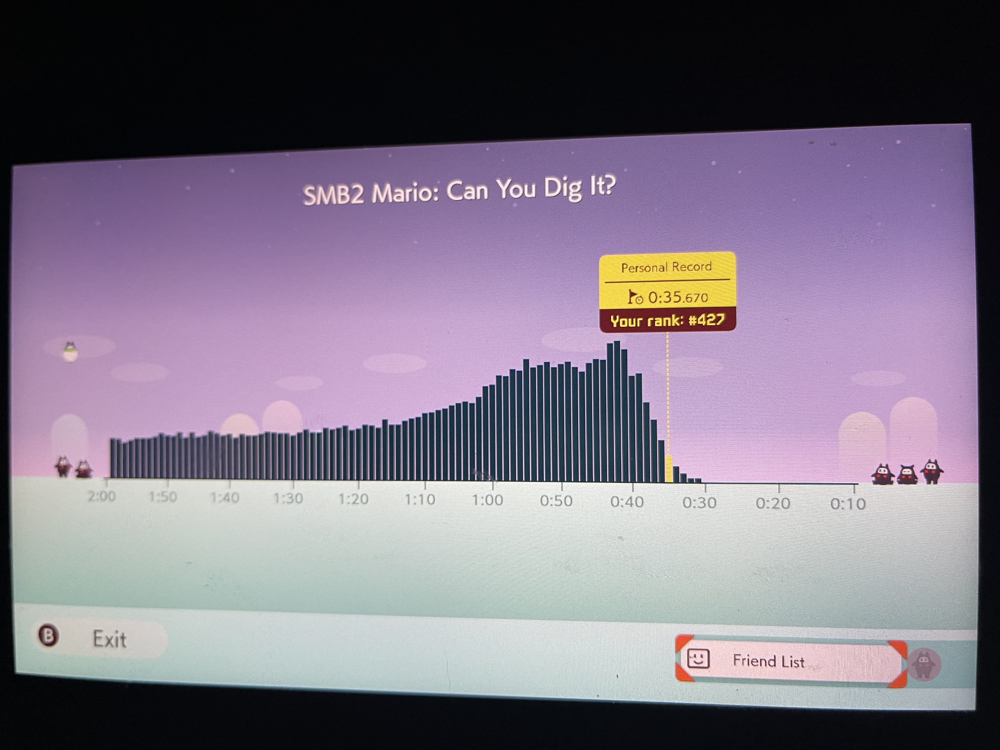
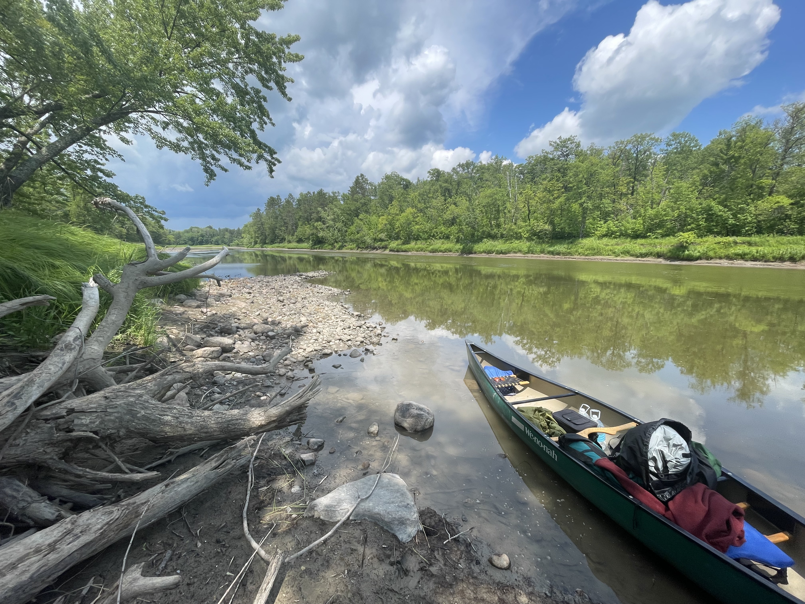
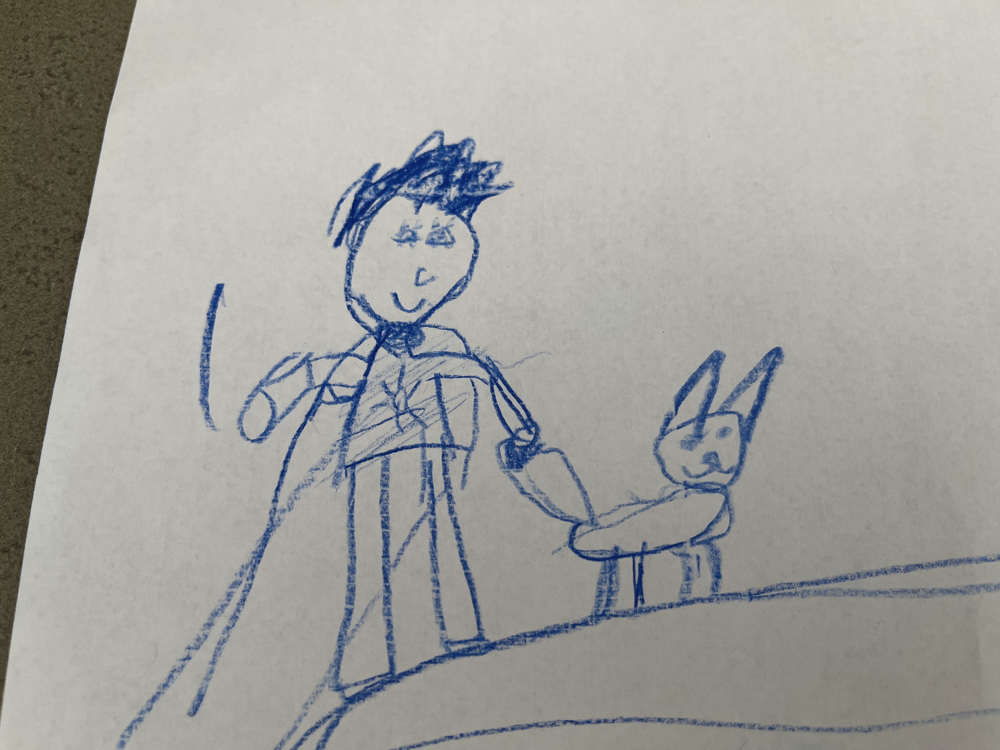
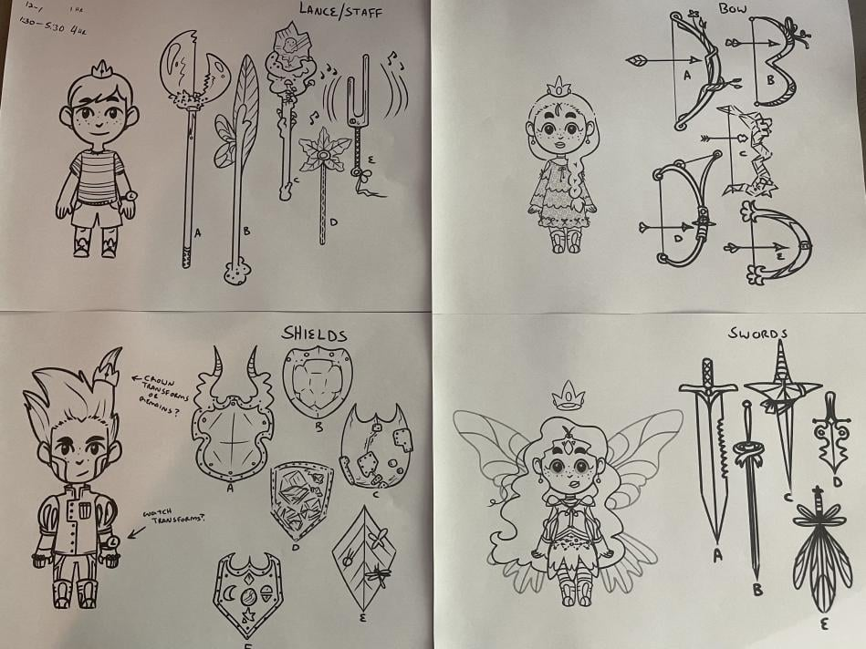
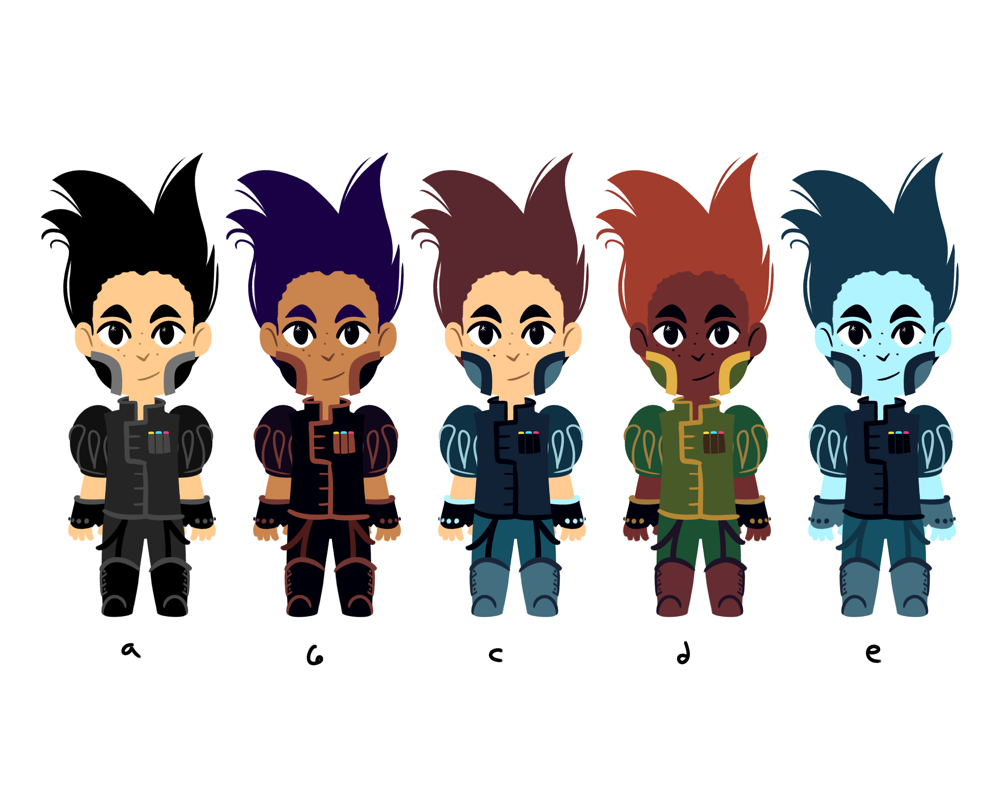
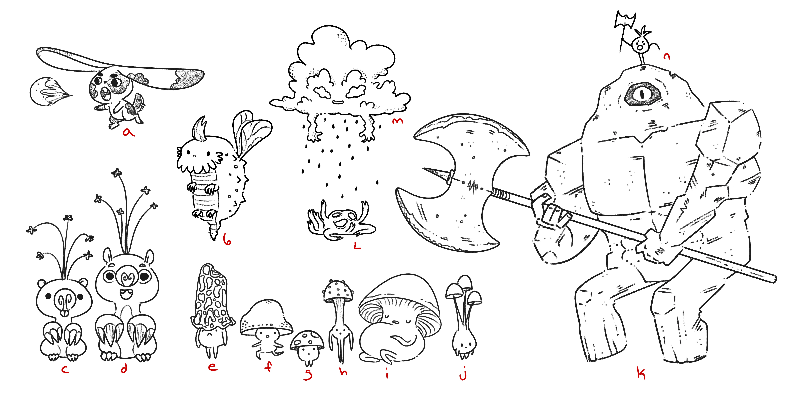
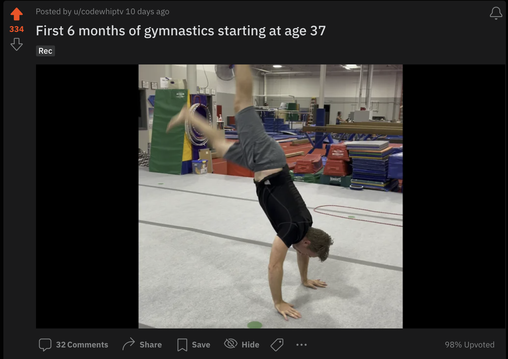
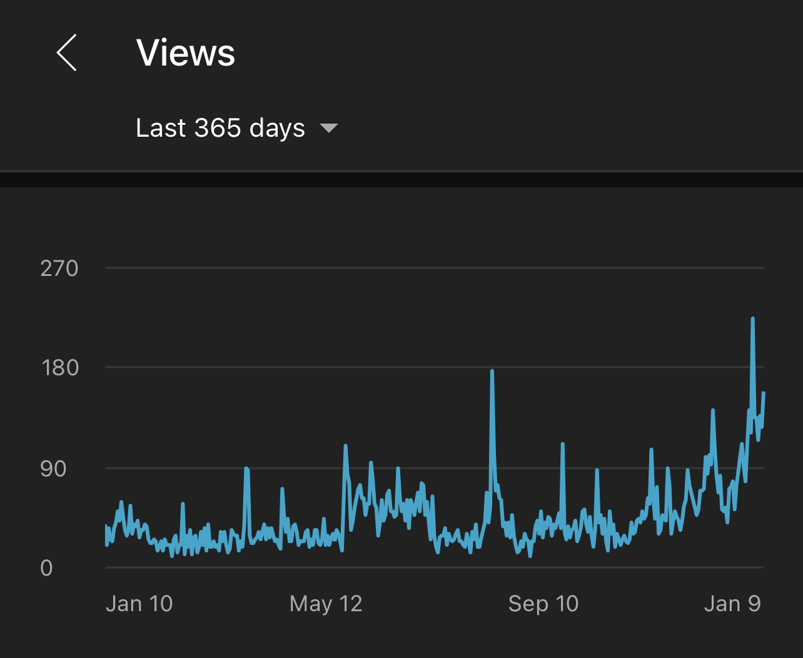
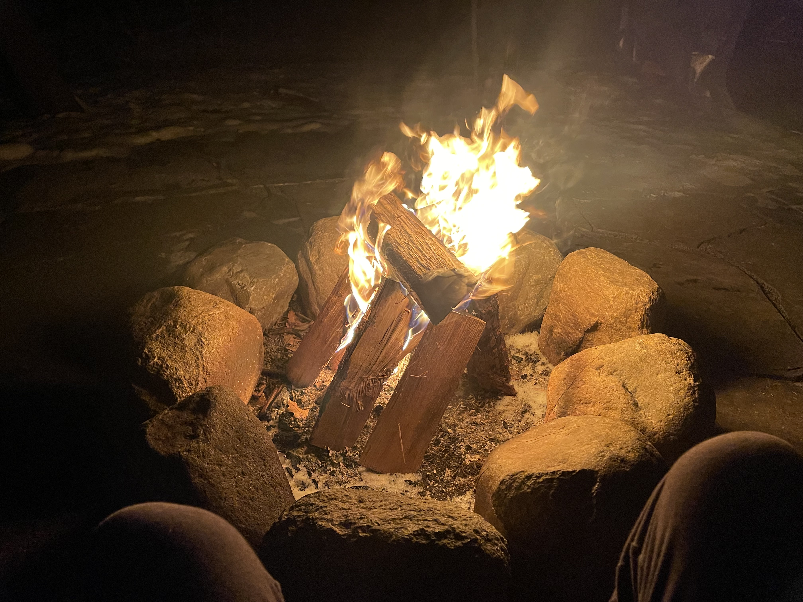

Happy New Year! 🥳 Glad 2022 is here.

Here's some interesting things from 2021!

## 🎮 Started Off 2021 with Mario Maker 2 Speed Running

With January being really cold and not getting out much due to the pandemic, why not start 2021 off with a Mario Maker 2 speed running competition? 🤪

I finished 464 out of 123k+ competitors! Who knew I was still good at Mario:

## 🛶 Canoe Trip Down the Mississippi

Towards the top of my list of memories from this year, my good friend Scott and I went on a four day canoe trip this summer. It was amazing.

This is your reminder if you're reading this to get outside, it's super good for your mind.

## 🎨 Video Game Concept Design with the Kids

A project we have been dipping our toes into with the kids is designing a videogame with them. Taking the kids' drawings and ideas as a basis for creating a videogame is super fun.

Then sending those drawings to a professional artist to make custom art:

Here's some more "final" art concepts cleaned up:

Here's another drawing of a bunch of monsters I just love.

Then the artist making them into real characters!

Looking forward to making the game, but I know it's going to be A LOT of work.

Really excited to kick this project off and start programming a simple version of the game, but as you may know, learning Unity isn't going to be easy! Projects like this die all the time, my goal is to not let this one. It has to become real someday.

## 🤸 Gymnastics

About 6 months ago I started going to an adult gymnastics class at the same gym as my son. He loves it since he gets to wave at Dad and we are both learning a lot of the same things (yes I'm learning the same things as a 7 year old does, ha).

With hard work I was actually able to land flat-ground front flips!

I posted montage of 6 months of progress and posted it on r/Gymnastics – and it hit the front page and the comments were super positive! Check out the video montage of my [first 6 months of Gymnastics](https://www.reddit.com/r/Gymnastics/comments/rtb6c0/first_6_months_of_gymnastics_starting_at_age_37/) – starting at age 37. 😝

I have some goals here:

- ✅ Front Lever
- ✅ Back hip circles on high bar
- ✅ Hand stand (I can hold one for 5-7 seconds)
- Front Flip -- almost there! (check the video linked above for progress)
- Pistol Squat
- Muscle Up
- Back bridge
- Hand stand for 30 seconds
- Running 4 miles until 8 minutes per mile
- Giants on bars!
- Wall run back flip? 😝

## 🥽 VR & Making YouTube Videos

[My VR hobby YouTube channel](https://www.youtube.com/channel/UC5W6ZgJB40-2NUYkhuqs2GA) crossed 200 subscribers (happy with it since it's just playing games). I only posted 8 videos this year, but I branched out a bit with some other games. 

The channel is growing pretty well lately too with the increasing adoption of VR in general:

The main new games I've found in VR are Stride (parkour like mirror's edge) and also a top-down stategy board game called Demeo that is super fun to play with friends and colleagues.

Here's my latest video:

`youtube: https://youtu.be/jS49q1GlRfU`

## 🔥 Real Fire Pit!

Finally, we built in a real fire pit into the back yard which has been great to still be outside in nature during cold days. I'm really enjoying it!

I wanted to include more things like messing around with drones, trips to the climbing wall, and making cherry pie...but you can only fit so many updates into one post before you have to just hit publish. Cheers and hope 2022 is off to a good start for you and yours!