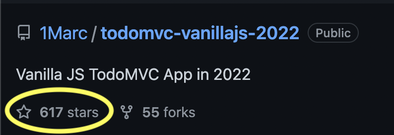

I took a shot at coding [TodoMVC with modern (ES6+), vanilla JavaScript](https://github.com/1Marc/todomvc-vanillajs-2022), and it only took ~170 lines of code and just over an hour! Compare this to the old/official TodoMVC vanilla JS solution, which has over 900 lines of [code](https://github.com/tastejs/todomvc/tree/gh-pages/examples/vanillajs). An 80%+ reduction in code! I ❤️ the new state of JavaScript.

The code has received over 🤩 600 stars on GitHub: 

[](https://github.com/1Marc/todomvc-vanillajs-2022)

In general, the responses were very positive. But as with all popular things, eventually, they spark debate.

# Four Top Arguments for Frameworks Over Vanilla JavaScript

## #1: "Frameworks Enable Declarative UI"

> Modern frameworks like React and Vue don't exist to fill in the gap left by native JS, they exist so that you write your application in a declarative way where the view is rendered as a function of state.

IMO this is simply a design pattern. Patterns apply in any language. 

You can accomplish roughly the same thing in vanilla JavaScript. In my code, when the model changes, it fires a `save` event, and then I wire `App.render()` to it, which renders the App using the Todos model.

```js
Todos.addEventListener('save', App.render);
```

Template strings end up pretty easy to work with when you want to re-render parts of the App from scratch as a framework would:

```js
insertHTML(li, `
  <div class="view">
    <input class="toggle" type="checkbox" ${todo.completed ? 'checked' : ''}>
    <label></label>
    <button class="destroy"></button>
  </div>
  <input class="edit">
`);
```

The entire App `render` method is only eleven lines, and it re-renders everything the App needs to based on the state of the App:

```js
render() {
  const count = Todos.all().length;
  App.$.setActiveFilter(App.filter);
  emptyElement(App.$.list);
  Todos.all(App.filter).forEach(todo => {
    App.$.list.appendChild( App.createTodoItem(todo) );
  });
  App.$.showMain(count);
  App.$.showFooter(count);
  App.$.showClear(Todos.hasCompleted());
  App.$.toggleAll.checked = Todos.isAllCompleted();
  App.$.displayCount(Todos.all('active').length);
}
```

Here I could have chosen to rebuild the entire UI as a template string as a function of state, but instead, it is ultimately more performant to create these DOM helper methods and modify what I want.

## #2: "Frameworks Provide Input Sanitization"

The best way to sanitize user input is to use `node.textContent`. 

```js
insertHTML(li, `
  <div class="view">
    <input class="toggle" type="checkbox" ${todo.completed ? 'checked' : ''}>
    <label></label>
    <button class="destroy"></button>
  </div>
  <input class="edit">
`);
li.querySelector('label').textContent = todo.title;
```

Any user input must be set to the DOM using `textContent`. If you do that, then you're fine.

Beyond this, there is a new [Trusted Types API](https://developer.mozilla.org/en-US/docs/Web/API/Trusted_Types_API) for sanitizing generated HTML. I would use this new API if I were generating nested markup with dynamic, user-input data. (Note that this new API isn't available yet in Safari, but hopefully, it will be soon)

> Trusted Types not being everywhere is fine. You can use them where they're supported and get early warning of issues. Security improves as browsers improve, and usage turns into an incentive for lagging engines ([source](https://twitter.com/slightlylate/status/1523425952218292224))

Suppose you want a library to build your app template strings without using textContent manually. In that case, you can use a library like [DOMPurify](https://github.com/cure53/DOMPurify), which uses Trusted Types API under the hood.

## #3: "Frameworks Provide DOM Diffing and DOM Diffing is Necessary"

The most common criticism was the lack of DOM Diffing in vanilla JavaScript.

> A reactive UI/diff engine is non-negotiable for me.

> Diffing is exactly what you need to do (barring newer methods like svelte) to figure out what to tell the browser to change. The vdom tree is much faster to manipulate than DOM nodes.

However, I think this is a much more balanced take:

> Diffing seems necessary when your UI gets complicated to the level that a small change requires a full page re-render. However, I don't think this is necessary for at least 95% of the websites on the internet.

I agree most websites and web apps don't suffer from this issue, even when re-rendering the needed components based on vanilla's application state like a framework. 

Lastly, I'll note that DOM diffing is inefficient for getting reactive updates because it doubles up data structures. Lit, Svelte, Stencil, Solid, and many others don't need it and are way more performant as a result. These approaches win on performance and memory use, which matters because garbage collection hurts the UX.

### 🔥 Hot Take: Many modern frameworks necessitate that you render the entire App client-side, which is slow.

My issue with modern frameworks forcing declarative UI (see #1) and DOM diffing (see #2) approach is that they necessitate unnecessary rendering and slow startup times. Remix is trying to avoid this by rendering server-side then "hydrating," and new approaches like Quik are trying not to have hydration altogether. It's an industry-wide problem, and people are trying to address it.

In my vanilla JavaScript projects, I only re-render the most minimal parts of the page necessary. Template strings everywhere, and especially adding DOM diffing, is inefficient. It forces you to render all of your App client-side increasing startup time and the amount the client has to do overall each time data changes.

That said, if you do need DOM diffing in parts of a vanilla app, libraries like [fastdom](https://github.com/wilsonpage/fastdom) do just that.

There is also a fantastic templating library called [Lit-html](https://lit.dev/docs/v1/lit-html/introduction/) that solves this problem of making your App more declarative in a tiny package (less than 1KB), and you can continue using template strings with that.

## #4: "Frameworks Scale, Vanilla JavaScript Will Never Scale"

I have built many large vanilla JavaScript projects and scaled them across developers, making the companies I worked for tons of money, and these apps still exist today. 🕺✨

Here's my potentially hot take on this one: Conventions and idioms are always needed, no matter if you have a framework. 

### 🔥 Hot Take: At the end of the day, your codebase will only be only as good as your team, not the framework.

The way vanilla JS scales is the same way any framework scales. You have to have intelligent people talk about the needs of the codebase and project.

That said, here's an example of adding ~20 lines of structure to the code in the [app architecture branch](https://github.com/1Marc/todomvc-vanillajs-2022/tree/app-architecture/js). It splits the code into a TodoList and App component. Each component implements a render method that optionally renders a filtered view of the data.

TodoList render:

```js
  render ( filter ) {
    if (filter !== undefined) this.filter = filter;
    emptyElement(this.$root);
    this.Todos.all(this.filter).forEach(todo => {
      this.$root.appendChild( this.renderTodo(todo) );
    });
  }
```

App render:

```js
  render( filter ) {
    const count = this.Todos.all().length;
    if (filter !== undefined) this.filter = filter;
    this.$.setActiveFilter(this.filter);
    this.$.showMain(count);
    this.$.showFooter(count);
    this.$.showClear(this.Todos.hasCompleted());
    this.$.toggleAll.checked = this.Todos.isAllCompleted();
    this.$.displayCount(this.Todos.all('active').length);
  }
```

Overall I'd argue either of my solutions are more performant, less code, and more straightforward than most, if not all, the TodoMVC implementations on the internet _— without_ a framework.

# Here are Seven Vanilla JavaScript Tips from the Code

## #1. Sanitization

User input must be sanitized before being displayed in the HTML to prevent XSS (Cross-Site Scripting). Therefore new todo titles are added to the template string using `textContent`:

```javascript
li.querySelector('label').textContent = todo.title;
```

## #2. Event Delegation

Since we render the todos frequently, it doesn't make sense to bind event listeners and clean them up every time. Instead, we bind our events to the parent list that always exists in the DOM and infer which todo was clicked or edited by setting the data attribute of the item `$li.dataset.id = todo.id;`

Event delegation uses the `matches` selector:

```javascript
export const delegate = (el, selector, event, handler) => {
    el.addEventListener(event, e => {
        if (e.target.matches(selector)) handler(e, el);
    });
}
```

When something inside the list is clicked, we read that data attribute id from the inner list item and use it to grab the todo from the model:

```javascript
delegate(App.$.list, selector, event, e => {
  let $el = e.target.closest('[data-id]');
  handler(Todos.get($el.dataset.id), $el, e);
});
```

## #3. insertAdjacentHTML

insertAdjacentHTML is [much faster](https://www.measurethat.net/Benchmarks/Show/10750/0/insertadjacenthtml-vs-innerhtml#latest_results_block) than innerHTML because it doesn't have to destroy the DOM first before inserting.

```javascript
export const insertHTML = (el, markup) => {
  el.insertAdjacentHTML('afterbegin', markup);
}
```

I also quite like this remove all child nodes helper, which is a fast way to clear the contents of an element:

```javascript
export const emptyElement = el => {
  while (el.hasChildNodes()) {
    el.removeChild(el.lastChild);
  }
}
```

## #4. Grouping DOM Selectors & Methods

DOM selectors and modifications are scoped to the `App.$.*` namespace. In a way, it makes it self-documenting what our App could potentially modify in the document.

```javascript
$: {
  input:    document.querySelector('.new-todo'),
  toggleAll:  document.querySelector('.toggle-all'),
  clear:    document.querySelector('.clear-completed'),
  list:   document.querySelector('.todo-list'),
  count:    document.querySelector('.todo-count'),
  setActiveFilter: filter => {
    document.querySelectorAll('.filters a').forEach(el => el.classList.remove('selected')),
    document.querySelector(`.filters [href="#/${filter}"]`).classList.add('selected');
  },
  showMain: show =>
    document.querySelector('.main').style.display = show ? 'block': 'none',
  showClear: show =>
    document.querySelector('.clear-completed').style.display = show ? 'block': 'none',
  showFooter: show =>
    document.querySelector('.footer').style.display = show ? 'block': 'none',
  displayCount: count => {
    emptyElement(App.$.count);
    insertHTML(App.$.count, `
      <strong>${count}</strong>
      ${count === 1 ? 'item' : 'items'} left
    `);
  }
},
```

## #5. Send Events on a Class Instance with Subclassing EventTarget

We can subclass EventTarget to send out events on a class instance for our App to bind to:

```javascript
export const TodoStore = class extends EventTarget {
```

In this case, when the store updates, it sends an event:

```javascript
this.dispatchEvent(new CustomEvent('save'));
```

The App listens to that event and re-renders itself based on the new store data:
 
```javascript
Todos.addEventListener('save', App.render);
```

## #6. Group Setting Up Event Listeners

It is essential to know exactly where the global event listeners are set. An excellent place to do that is in the App init method:

```js
init() {
  Todos.addEventListener('save', App.render);
  App.filter = getURLHash();
  window.addEventListener('hashchange', () => {
    App.filter = getURLHash();
    App.render();
  });
  App.$.input.addEventListener('keyup', e => {
    if (e.key === 'Enter' && e.target.value.length) {
      Todos.add({ title: e.target.value, completed: false, id: "id_" + Date.now() })
      App.$.input.value = '';
    }
  });
  App.$.toggleAll.addEventListener('click', e => {
    Todos.toggleAll();
  });
  App.$.clear.addEventListener('click', e => {
    Todos.clearCompleted();
  });
  App.bindTodoEvents();
  App.render();
},
```

Here we set up all the global event listeners, subscribe to the store mentioned above, and then initially render the App.

Similarly, when you create new DOM elements and insert them into the page, group the event listeners associated with the new elements near where they are made.

## #7. Render the State of the World Based on Data (Data Flowing Down)

Lastly, to reiterate what I said above, render everything based on the state in the `render()` method. This is a pattern lifted from modern frameworks.

### Make sure you update the DOM based on your App state, not the other way around. Even better if you avoid reading DOM to derive _any_ state apart from finding your target for event delegation.

Side note: I like to rely on the server to generate the markup for faster boot times, then take control of the bits we show. Have the CSS initially hide things you don't need, and then have the JavaScript show the elements based on the state. Let the server do most of the work where you can, rather than wait for the entire App to render client-side.

## IMO, Vanilla JavaScript is More Viable Today Than Ever for Building Web Apps!

JavaScript is better today than it has ever been. 

The fact that I could shave off 80% of the code over the previous TodoMVC years ago at the drop of a hat feels terrific. Plus, we now have established design patterns that we can lift from modern frameworks to apply to vanilla JavaScript projects to make our UIs as declarative as we like.

### 🔥 Hot Take: I'd like us as an industry to consider pure JavaScript as an option for more projects.

Finally, as Web Components get more ergonomic, we even have a way to share our code in an interoperable and framework-agnostic way. 

I hope you enjoyed the post. Please send your feedback to me [@1marc on Twitter](https://twitter.com/1Marc). Cheers!