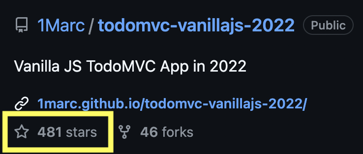

I coded [TodoMVC with Vanilla JavaScript in 2022](https://github.com/1Marc/todomvc-vanillajs-2022) to see just how far JavaScript has come since ES6 and beyond. **My pure JavaScript solution took ~170 lines of code in just over an hour!** Compare this to the [official TodoMVC vanilla JS](https://github.com/tastejs/todomvc/tree/gh-pages/examples/vanillajs) solution which is well over 900 lines of code. 

Since posting my solution, I was surprised to see the repo has received over 450 stars on GitHub:

[](https://github.com/1Marc/todomvc-vanillajs-2022)

It was also discussed on social sites like [Hacker News](https://news.ycombinator.com/item?id=31293750).

## Criticism: Input Sanatization 

The best way to sanatize user input is to use `node.textContent`. [I updated my code to use textContent](https://github.com/1Marc/todomvc-vanillajs-2022/blob/main/js/app.js#L68)

Beyond this, there is a new [Trusted Types API](https://developer.mozilla.org/en-US/docs/Web/API/Trusted_Types_API) for sanatizing dynamically generated HTML. With JavaScript, I would update my code to use this method if I was generating lots of nested markup. (Note that it isn't available yet in Safari, but hopefully it will be soon)

## Addressing the Top 3 Common Criticisms

## Critcism #1: Frameworks Enable Declarative UI

> Modern frameworks like React and Vue don't exist to fill in the gap left by native JS, they exist so that you write your application in a declarative way where the view is rendered as a function of state.

I was able to accomplish this in my vanilla JavaScript code by calling `App.render()` when the model changes. [See the code here](https://github.com/1Marc/todomvc-vanillajs-2022/blob/main/js/app.js#L19)

## Crticism #2: Frameworks have DOM Diffing

This was the most common critcism cited:

> A reactive UI/diff engine is non-negotiable for me.

> Diffing is exactly what you need to do (barring newer methods like svelte) to figure out what to tell the browser to change. The vdom tree is much faster to manipulate than DOM nodes.

However I agree with this (more balanced, IMO) take:

> Diffing seems necessary when your UI gets complicated to the level that a small change requires a full page re-render. However, I don't think this is necessary for at least 95% of the websites on the internet.

I agree with him that most websites and web apps don't suffer from this issue, even when re-rendering the components that are needed based on the application state like a modern framework would. The thing with modern frameworks, is that they typically neccessitate that you render the entire app client-side. In my vanilla JS projects, I only re-render the smallest parts of the page neccessary.

That said, if you need to solve this problem specifically and need DOM diffing, there are two micro library solutions:

* [Lit-html](https://lit.dev/docs/v1/lit-html/introduction/) is an example of a tool that solves this problem in tiny package (less than 1KB) and you can continue using string templates with that.

* [fastdom](https://github.com/wilsonpage/fastdom)

## Critcism #3: Vanilla JavaScript Will Never Scale

This one is more complicated to address. I've built many large JavaScript projects and have scaled them across many developers, along the way making these companies tons of money and some of these apps still exist and are used today. 

This is my hot take: A codebase is only as good at the team, not the conventions. Conventions and idioms are needed regardless if you have a framework, and they are only as good as the team.

The way vanilla JS scales is the same way any framework scale. You have to have smart people talk about the needs of the codebase and project.

So with that, here's my JavaScript idioms and conventions I can demonstrate in this application:

## The Top 5 JavaScript Idioms and Conventions found in my TodoMVC Code

Many people were super postive about this no-nonsense approach, however, and asked me to create learning materials around vanilla JavaScript. I've built large apps and do know they scale, but you need to follow some language idioms and conventions to make it work.

Here are the conventions I can demonstrate in this codebase.

### 1. Prefix variables containing DOM nodes to $varname or $.* namespace.

```js
	$: {
		input:		document.querySelector('.new-todo'),
		list: 		document.querySelector('.todo-list'),
		count: 		document.querySelector('.todo-count'),
		footer: 	document.querySelector('.footer'),
		toggleAll: 	document.querySelector('.toggle-all'),
		main: 		document.querySelector('.main'),
		clear: 		document.querySelector('.clear-completed'),
		filters: 	document.querySelector('.filters'),
	},
```

### 2. Subclass EventTarget to Send Events Out

Subclassing EventTarget on the TodoStore allows us to send out custom events to listen to anywhere in your app upon save.

[`export const TodoStore = class extends EventTarget`](https://github.com/1Marc/todomvc-vanillajs-2022/blob/main/js/store.js#L1)

Firing the save event on the store:

[`this.dispatchEvent(new CustomEvent('save'));`](https://github.com/1Marc/todomvc-vanillajs-2022/blob/main/js/store.js#L17)

In this case, in the app init method we subscribe to this event and render when the store changes:

[`Todos.addEventListener('save', App.render);`](https://github.com/1Marc/todomvc-vanillajs-2022/blob/main/js/app.js#L19)

Hat tip to [Alex Russel for teaching me this one](https://twitter.com/slightlylate/status/1520820888035225600).

### 3. Setup All Global Event Listners in One Place

In the App init method, we setup all the global event listeners, subscribe to the store as metioned above, and then render the app.

```js
	init() {
		Todos.addEventListener('save', App.render);
		window.addEventListener('hashchange', () => {
			App.filter = getURLHash();
			App.render();
		});
		App.$.input.addEventListener('keyup', e => {
			if (e.key === 'Enter') {
				App.addTodo(e.target.value);
				App.$.input.value = '';
			}
		});
		App.$.toggleAll.addEventListener('click', e => {
			Todos.toggleAll();
		});
		App.$.clear.addEventListener('click', e => {
			Todos.clearCompleted();
		});
		App.render();
	},
```

### 4. Keep Rendering Component and Component's Event Listeners in One Place

```js
	createTodoItem(todo) {
		const li = document.createElement('li');
		if (todo.completed) { li.classList.add('completed'); }

		li.innerHTML = `
			<div class="view">
				<input class="toggle" type="checkbox" ${todo.completed ? 'checked' : ''}>
				<label></label>
				<button class="destroy"></button>
			</div>
			<input class="edit">
		`;

		li.querySelector('label').textContent = todo.title;
		li.querySelector('.edit').value = todo.title;

		addEvent(li, '.destroy', 'click', () => App.removeTodo(todo, li));
		addEvent(li, '.toggle', 'click', () => App.toggleTodo(todo, li));
		addEvent(li, 'label', 'dblclick', () => App.editingTodo(todo, li));
		addEvent(li, '.edit', 'keyup', e => {
			if (e.key === 'Enter') App.updateTodo({ ...todo, title: e.target.value }, li)
			if (e.key === 'Escape') {
				e.target.value = todo.title;
				App.render();
			}
		});
		addEvent(li, '.edit', 'blur', e => App.updateTodo({ ...todo, title: e.target.value }, li));

		return li;
	},
```

Here we want to create the todo items using template strings:

```js
		li.innerHTML = `
			<div class="view">
				<input class="toggle" type="checkbox" ${todo.completed ? 'checked' : ''}>
				<label></label>
				<button class="destroy"></button>
			</div>
			<input class="edit">
		`;
```

Then sanatize the user input using `textContent`:

```js
		li.querySelector('label').textContent = todo.title;
		li.querySelector('.edit').value = todo.title;
```

Then setup our component's event listners in one spot.

Note that I created my own little `addEvent` helper because I just thought it was a bit nicer API for binding events.

```js
export const addEvent = (el, selector, event, handler) =>{
    el.querySelector(selector).addEventListener(event, e => handler(e));
}
```

Overall the key here is to put all the component code in one place, just like you'd find in React and other modern frameworks. This keeps our UI declarative, addressing one of the main critcisms.

### 5. Render the State of the World Based on Data (Data Flowing Down)

Lastly, I've got all my logic for rendering grouped in the App.render method:

```js
		const todosCount = Todos.all().length;
		App.$.filters.querySelectorAll('a').forEach(el => el.classList.remove('selected'));
		App.$.filters.querySelector(`[href="#/${App.filter}"]`).classList.add('selected');
		App.$.list.innerHTML = '';
		Todos.all(App.filter).forEach(todo => {
			App.$.list.appendChild( App.createTodoItem(todo) );
		});
		App.$.footer.style.display = todosCount ? 'block' : 'none';
		App.$.main.style.display = todosCount ? 'block' : 'none';
		App.$.clear.style.display = Todos.hasCompleted() ? 'block' : 'none';
		App.$.toggleAll.checked = todosCount && Todos.isAllCompleted();
		App.$.count.innerHTML = `
			<strong>${Todos.all('active').length}</strong>
			${Todos.all('active').length === 1 ? 'item' : 'items'} left
		`;
```

I agree this looks a bit messy at first glance. But the alternative here is to put everything in our app in templated components like above. I'd rather rely more on the server to render, and have complete control over the bits we hide and show based on the state. This is accomplishing what you would get with DOM diffing manually, but again we let the server render rather than having to render the entire app client side.

There you have it! I'll continue to update this post as I have more thoughts on it.