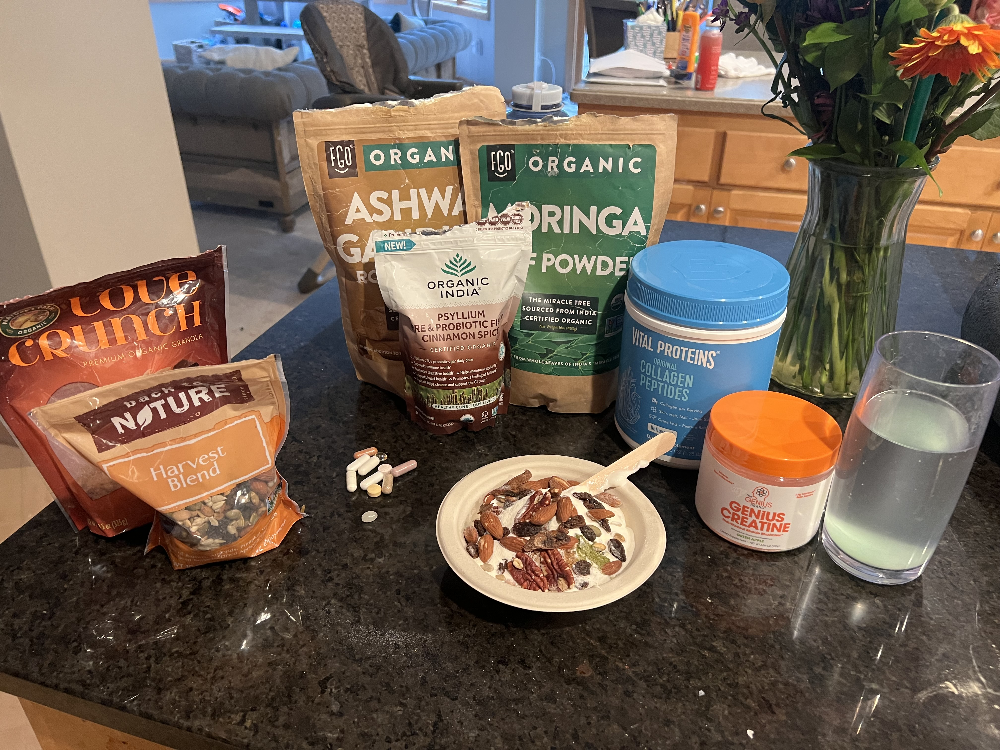
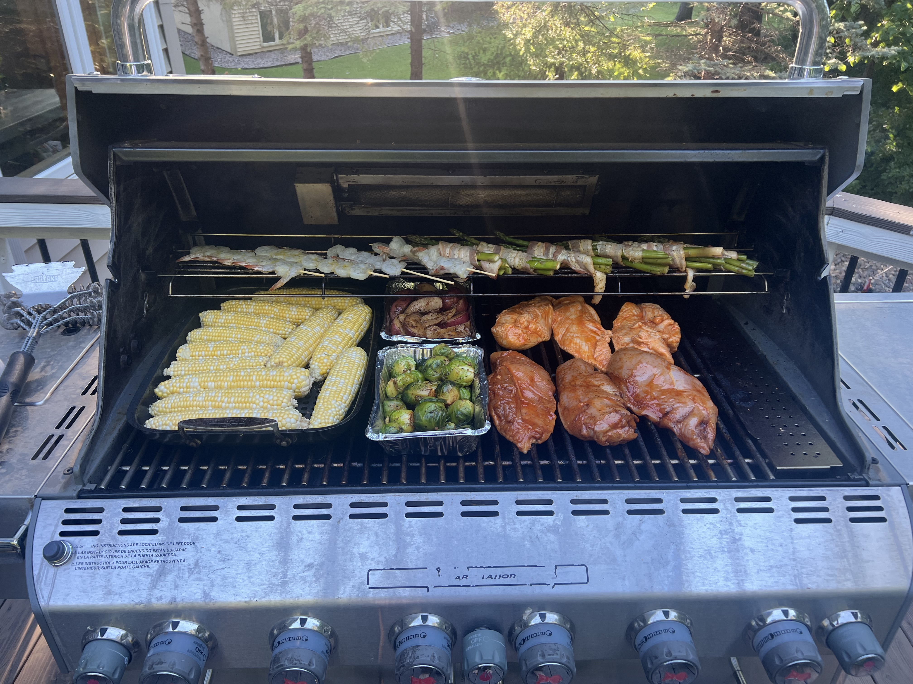

Consult your doctor on the best course of action for you. This checklist is for my reference primarily, but hopefully, sharing it can help you too.

Nothing here is revolutionary. It is a checklist to browse and remind yourself to make better and healthier habits. I use this daily/weekly/monthly to ensure I am incorporating all of these items regularly into living a healthy life.

## Eating Healthier

* Avoid processed foods (mainly processed meats) to reduce overall sodium intake and eat more nutritious foods.
* Walk or do some simple exercise after you eat.
* Limit alcohol or remove it altogether!
* Eat slower. Being in the present moment while eating can prevent overeating and help with better digestion.
* Drink more water. Usually, a good rule of thumb is at least 2L per day, but it could be more depending on your weight.
* Eat more fiber and vegetables and less meat. More lean meat and fish rather than red meat. The less sugar, the better.
  
`youtube: https://www.youtube.com/watch?v=bUPjO-sWWmY`

* Eat less often in general. Incorporate some form of fasting.

`youtube: https://www.youtube.com/watch?v=Wzmacu2TgFg`

## Supplements

* Get your blood tested to determine what nutritional supplements you should take. Universal supplements challenging to get enough of in modern society include, but are not limited to: Fish Oil, B12, Vitamin D, Magnesium, and Calcium.

`youtube: https://www.youtube.com/watch?v=2QqK4WlGXbg`

* Sleep 7-9 hours per night; best to be at the same time every night. Some studies suggest that Melatonin ~2 hours before bed helps you get higher quality sleep.

## Exercise

* Aerobic capacity (V02 Max) is the strongest predictor of future health. Train VO2 max by maxing out your heart rate for four minute periods through sprinting, rowing, HIT, or other intense, short-term cardio activities. Strength training important to build and maintain muscle mass.

`youtube: https://www.youtube.com/watch?v=ojOEGfTYCjA`

* Mobility is crucial. Stretch/do yoga daily in the morning and at night.

## Self Care

* Brush your teeth daily (3 times is best) and get your teeth professionally cleaned every six months. I was surprised to find that lousy mouth health is associated with an increased risk of heart disease.
* Take ice-cold showers and, even better yet, ice baths. Minimally has been shown to increase your mood and decrease inflammation.
* Regular sauna use is linked to significantly lower rates of cardiovascular issues and related deaths.
* Breathe through your nose primarily, especially at night.
* Interacting with animals has been shown to decrease levels of cortisol (a stress-related hormone) and lower blood pressure
* Jumping on trampolines is great for your joint and ligament health
* Learn to breathe and meditate
* People with a sense of humor live longer. And people who are optimistic live longer. Be optimistic and laugh more!
  > A meta-analysis from 6 prospective cohort studies (n=181,709) found that patients with a more optimistic mindset were at lower risk for all-cause mortality (HR 0.87, 95% CI 0.82–0.92).
  > Less worrying, more living 😀✌️
  > ([source](https://twitter.com/BradStanfieldMD/status/1522354631279804417?s=20&t=jmUDKqg0erLH92WG7irRGw))

# Things I Do to Stay Healthy

## Keeping Tabs on My Overall Health Data

- Qardio fitness smart scale at home I step on every day
- HRV is a predictor of overall health. 0-50 is unhealthy, 50-100 is ok, and 100+ is healthy. You can see trends in your Apple Health app (I wear the latest Apple watch)
- Professionally test body composition, VO2 Max, and RMR through [DEXA](https://www.dexafit.com/dexafit-store-mapper)
- Every 3-6 months, I do a blood panel through [Inside Tracker](https://www.insidetracker.com/) and follow the recommendations

Overall with this data, I'm looking for trends over time. I try to look at monthly weight trends rather than day-to-day. For instance, weight can vary by as much as 7 pounds depending on when I ate, how much water, etc. Blood tests are super accurate but can change a ton over time.

## Exercise

- Weekly gymnastics class year-round
- In-ground trampoline, jumping ~20 minutes per day
- Straight-arm bar hangs for 60+ seconds (I used to do pull-ups but found bar hangs to be better for shoulder mobility) – my current record is 90 seconds
- Daily stretching and handstands
- Occasionally run or bike, but I should do more
- Jump training (currently trying to increase my vertical from 27" to 35"+)

## Diet and Supplements

- Moringa powder (overall nutrients)
- Collagen Peptides (skin and joint health)
- Psyllium husk + fiber (more fiber, the better)
- Ashwagandha powder (naturally increase T levels)

It is mixed in 2 cups of Zero Sugar Chobani yogurt and [Harvest Blend Back to Nature Trail Mix](https://amzn.to/3z6Bjd8).

- Creatine 5g mixed in water

Drink 1L of water in the morning and drink 1-2L more daily.

### My Supplement Stack in 2022

- Vitamin D 2000
- Calcium 500 & Magnesium 250
- Potassium 500
- Hesperidin 50 Duosmin 450
- K2 MK7 100
- B12 2500
- R-Lipoic Acid 283

I also take these food extracts and probiotics, but I hear they might be snake oil:

- Green tea extract
- Garlic extract
- Artichoke extract
- Probiotic Blend

I'm also going to start supplementing with Melatonin at night to see if that helps sleep quality.

- Eat more vegetables! Here's a picture of grilling recently where the only unhealthy thing on the grill is the bacon around the asparagus

## General Health

- Sauna 4-5 days per week
- Cold showers and ice baths daily (cools the water down to 34F just above freezing) for regular ice baths
- Brush and floss daily
- Apply full-spectrum SPF in the AM
- Beyond my morning Collagen, I also have Collagen chews I occasionally eat to try to get more in

## Mental Health

- Hot baths with Epsom salt
- Cold showers and ice baths every day
- Walks around my neighborhood or back yard. Listening to Spotify/music while walking is amazing

## Organizing Thoughts

- Apple notes app on my phone and mac to take notes
- Blinkist to go through non-fiction books and take notes to improve my life
- Sharing notes through Discord communities of like-minded people

# Final Thoughts

I'm about a year into developing and following all of these items. 

What did I miss? Tweet at me [@1marc](https://twitter.com/1Marc).

I think the main thing that's missing from my perspective is results. I've been following this for about 6-12 months, and maybe I'll do before/after pictures and talk more about benefits in 2023 once I've been able to maintain this lifestyle for closer to 24 months.