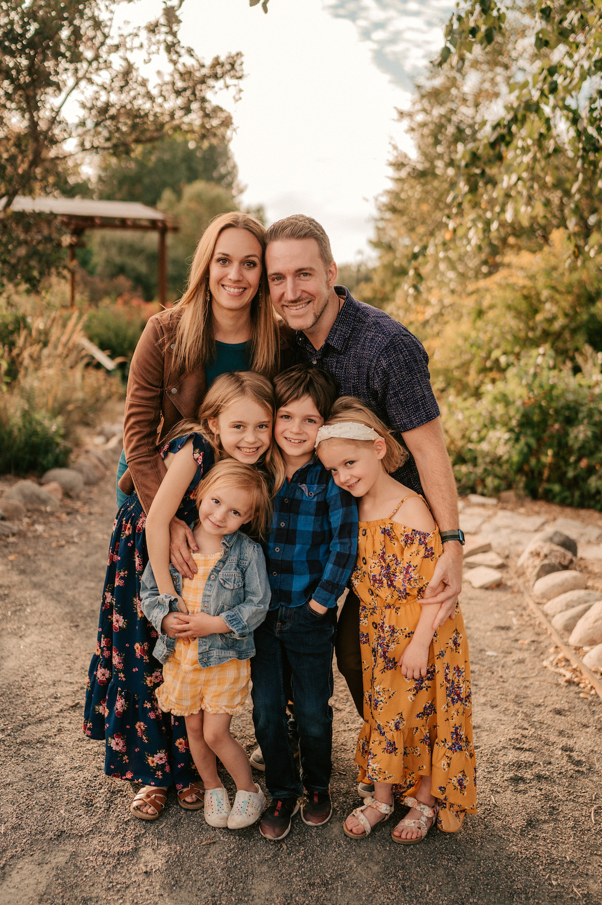
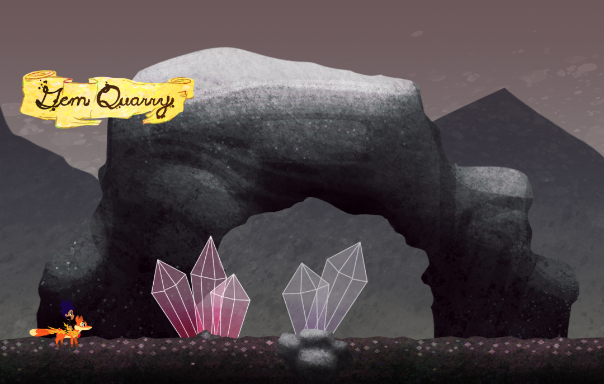
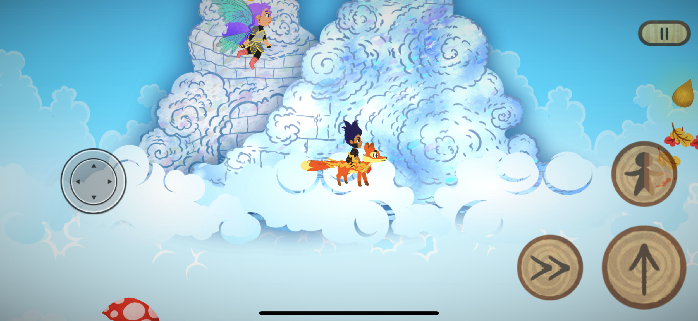
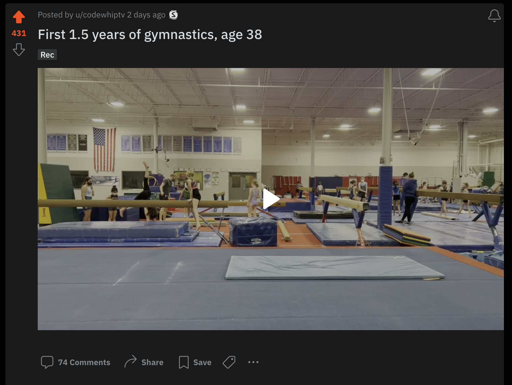

Happy new year! Here are some highlights from 2022.

My family is growing up. Our oldest turned 10! 🤔 To say it's got me thinking is a bit of an understatement.

## 55 Workshop Recording Days in the Frontend Masters Studio!

Frontend Masters content recording came back really strong &mdash; our teachers killed it this year. We recorded some fantastic workshops this year, and we have so many courses to release throughout the start of the year.

Some projects we launched this year:

- Upgraded course recording quality to 4k quality.
- Ran the community sale, a record sale month, where we launched User profiles and a Discord community.
- Released a new onboarding system with a super smooth billing system and a new team’s ability to manage their licenses.
- Migrated 100% of our back-end to Go. Bye-bye, legacy systems!
- Hired our Senior QA Engineer, who pioneered releasing a new customer feedback system. Thanks to it, we’ve been able to address hundreds of issues across our course library.
- Deployed video streaming closer to our customers in major locations such as Berlin, Mumbai, Singapore, and Rio de Janeiro.
- Rebuilt and upgraded our workshop recording space in Minneapolis, MN, for better A/V and faster editing.

➡️ This year, we have too many goals and projects to list, but one of the higher-level ones is to expand our team in a few key areas.

## Coded TodoMVC in Modern JavaScript

I [wrote TodoMVC using modern JavaScript](https://github.com/1Marc/modern-todomvc-vanillajs). It became a popular project with over 700 GitHub stars. I addressed feedback as it came up and learned a lot through the project. From there, I built examples of app architecture, performant DOM updates, TypeScript, and some UI components.

➡️ This year, I’d love to tackle another project with a “vanilla” approach &mdash; maybe something like the Movies app.

## Created a Personal Health Checklist System

This year I did a ton of health research to set up a system I can live by to live a healthy life. I distilled all that research into a [Personal Health Checklist](https://marcgrabanski.com/personal-health-checklist) that a world-renown longevity doctor, Dr. Brad Steinfield, reviewed.

➡️ This year, I want to continue adhering to this while revising and expanding it.

## Videogame Progress

I found an excellent programmer and artist for the family game. It’s progressing nicely, and every kid we’ve had play it loves it, but to take something like this to production is a massive project.

I’m a product guy with no experience in the gaming industry, so although I know what makes a great game, and I love how the game is turning out, I honestly don’t know exactly what I’m going to do with it the game in terms of marketing and roll out.

➡️ The game seems perfect to sell to something like Apple Arcade or Netflix Mobile Games. If y’all have any contacts or advice for me here, let me know.

## My First Full Year of Gymnastics

My montage of the year went viral on r/Gymnastics! 400+ upvotes and tons of positive comments and DMs:

It's clear I'm inspiring folks to get out there and do awesome stuff in their 30s and 40s.

Lots of progress; here’s my list of things I learned this year ✅ versus the milestones to improve to ➡️

- ✅ Max ~27" vertical ➡️ 30"-35" vertical
- ✅ Max ~12-15 seconds handstand ➡️ 30+ seconds consistent
- ✅ Front flips ➡️ higher and consistent/comfortable on flat ground
- ✅ Backflips ➡️ higher and consistent/comfortable on flat ground
- ✅ Did giants on the high bar! (w/grips) ➡️ consistent/comfortable giants without needing grips
- ✅ Pistol Squats (w/40 pounds counterweight) ➡️ Pistol Squats with no counterweight
- ✅ Increased mobility from yoga and assisted stretching ➡️ Progress towards splits, palm on the ground forward folds, and proper back bridge, too many to list
- ✅ Tuck press to handstand ➡️ Free-standing handstand push-ups
- ✅ L sit 20 seconds ➡️ L sit pull-ups
- ✅ Max bar hangs 90 seconds ➡️ Keep improving grip strength
- ❌ Muscle ups ➡️ Get it this year
- ❌ Run under 8 minutes per mile for 4 miles ➡️ Get it this year

➡️ Overall, I want to continue this journey and keep progressing daily! Also, a significant addition to my routine that I want to incorporate is 🥵 sauna and 🥶 ice baths.

I am excited to continue! Follow along on Instagram if you’d like: https://www.instagram.com/1marc/